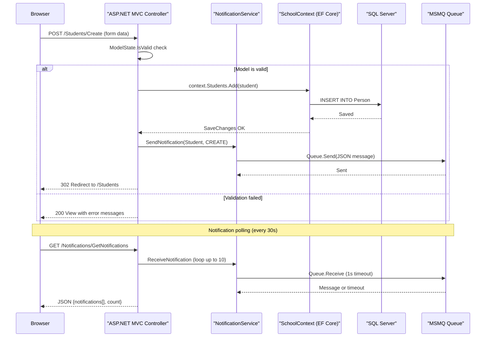

# API & Service Communication Contracts

ContosoUniversity exposes 30+ server-side MVC action endpoints across 6 controllers, plus a small JSON API for notification polling. All communication is synchronous HTTP/HTML with no authentication or TLS enforcement configured.

## Service Catalog

| Service | Port | Category | Purpose |
|---------|------|----------|---------|
| ContosoUniversity Web App | 80/443 (IIS Express) | Business | Monolithic ASP.NET MVC 5 web application for university management |

## API Endpoints Inventory

| Controller | Method | Path | Request Type | Response Type |
|------------|--------|------|-------------|---------------|
| HomeController | GET | / | — | View (enrollment statistics) |
| HomeController | GET | /Home/Index | — | View (enrollment date groups) |
| StudentsController | GET | /Students | sortOrder, currentFilter, searchString, page | View (paginated student list) |
| StudentsController | GET | /Students/Details/{id} | id (int) | View (student + enrollments) |
| StudentsController | GET | /Students/Create | — | View (create form) |
| StudentsController | POST | /Students/Create | Student model (LastName, FirstMidName, EnrollmentDate) | Redirect / View |
| StudentsController | GET | /Students/Edit/{id} | id (int) | View (edit form) |
| StudentsController | POST | /Students/Edit/{id} | Student model | Redirect / View |
| StudentsController | GET | /Students/Delete/{id} | id (int) | View (delete confirmation) |
| StudentsController | POST | /Students/Delete/{id} | id (int) | Redirect |
| CoursesController | GET | /Courses | — | View (course list) |
| CoursesController | GET | /Courses/Details/{id} | id (int) | View |
| CoursesController | GET | /Courses/Create | — | View (create form) |
| CoursesController | POST | /Courses/Create | Course model + HttpPostedFileBase (image) | Redirect / View |
| CoursesController | GET | /Courses/Edit/{id} | id (int) | View (edit form) |
| CoursesController | POST | /Courses/Edit/{id} | Course model + HttpPostedFileBase (image) | Redirect / View |
| CoursesController | GET | /Courses/Delete/{id} | id (int) | View |
| CoursesController | POST | /Courses/Delete/{id} | id (int) | Redirect |
| DepartmentsController | GET | /Departments | — | View |
| DepartmentsController | GET | /Departments/Details/{id} | id (int) | View |
| DepartmentsController | GET | /Departments/Create | — | View |
| DepartmentsController | POST | /Departments/Create | Department model | Redirect / View |
| DepartmentsController | GET | /Departments/Edit/{id} | id (int) | View |
| DepartmentsController | POST | /Departments/Edit/{id} | Department model (with RowVersion) | Redirect / View |
| DepartmentsController | GET | /Departments/Delete/{id} | id (int) | View |
| DepartmentsController | POST | /Departments/Delete/{id} | id + RowVersion | Redirect |
| InstructorsController | GET | /Instructors | id (int?), courseID (int?) | View |
| InstructorsController | GET | /Instructors/Details/{id} | id (int) | View |
| InstructorsController | GET | /Instructors/Create | — | View |
| InstructorsController | POST | /Instructors/Create | Instructor model + selectedCourses[] | Redirect / View |
| InstructorsController | GET | /Instructors/Edit/{id} | id (int) | View |
| InstructorsController | POST | /Instructors/Edit/{id} | Instructor model + selectedCourses[] | Redirect / View |
| InstructorsController | GET | /Instructors/Delete/{id} | id (int) | View |
| InstructorsController | POST | /Instructors/Delete/{id} | id (int) | Redirect |
| NotificationsController | GET | /Notifications/GetNotifications | — | JSON {success, notifications[], count} |
| NotificationsController | POST | /Notifications/MarkAsRead | id (int) | JSON {success} |
| NotificationsController | GET | /Notifications/Index | — | View (notification dashboard) |

## Management & Observability Endpoints

| Service | Endpoint | Custom Metrics |
|---------|----------|----------------|
| ContosoUniversity | None configured | None |

No health check, metrics, or observability endpoints are exposed. No Spring Actuator equivalent (such as ASP.NET health checks at `/health`) is configured.

## DTOs & Contracts

The application uses EF Core entity classes directly as view models — there is no separate DTO layer. Entities are passed directly to Razor views and bound from form POST bodies using `[Bind(Include = "...")]` attributes.

**Entity classes used as view/form contracts:**
- `Student` — form model for Create/Edit, list/detail view model
- `Instructor` — form model for Create/Edit; combined with `OfficeAssignment` as a nested property
- `Course` — form model including optional `HttpPostedFileBase` for image upload
- `Department` — form model with `RowVersion` byte[] for optimistic concurrency
- `Enrollment` — used in student details view (read-only)
- `Notification` — used as JSON response model from NotificationsController

**View-specific models (in `Models/SchoolViewModels/`):**
- `InstructorIndexData` — aggregates `Instructors`, `Courses`, and `Enrollments` for the instructor index view
- `AssignedCourseData` — used to render course checkboxes in instructor create/edit
- `EnrollmentDateGroup` — used in the home page dashboard to show enrollment counts by date

No OpenAPI/Swagger specifications, protobuf schemas, or GraphQL schemas are present. JSON serialization uses `Newtonsoft.Json` for the notifications API and `JsonRequestBehavior.AllowGet` on GET JSON actions.

## Communication Patterns

**Synchronous (only):** All client-server communication is synchronous HTTP. The browser sends HTML form POSTs or GET requests; the server renders a Razor view or redirects. There is no AJAX beyond the notification polling script.

**Asynchronous (MSMQ):** `NotificationService` publishes change events (CREATE/UPDATE/DELETE) to a Windows MSMQ private queue (`.\Private$\ContosoUniversityNotifications`). The `NotificationsController.GetNotifications()` action polls this queue synchronously via a JavaScript `setInterval` timer on the client side. This is not true async messaging — it is a polling pattern over a local queue.

**No resilience patterns:** No circuit breaker, retry policies, timeouts, or fallback behavior are configured anywhere in the application.

**No service discovery:** The application is a monolith with no service registry. The database connection string is read directly from Web.config via `ConfigurationManager`.

**No API gateway:** The application is a single-tier monolith with no gateway layer.

**Security posture:** No authentication or TLS is configured. All 30+ action endpoints are publicly accessible with no authorization checks. The `[ValidateAntiForgeryToken]` attribute is applied on all POST actions, providing CSRF protection. No JWT, OAuth2, Basic Auth, or Windows Authentication is in use. HTTPS is not enforced at the application level.

## Service Technology Matrix

| Service | Web Framework | Data Access | Discovery | Gateway | Health Checks | Cache | Metrics |
|---------|--------------|-------------|-----------|---------|---------------|-------|---------|
| ContosoUniversity | ASP.NET MVC 5 | EF Core 3.1 | None | None | None | None | None |

## Service Communication Sequence

