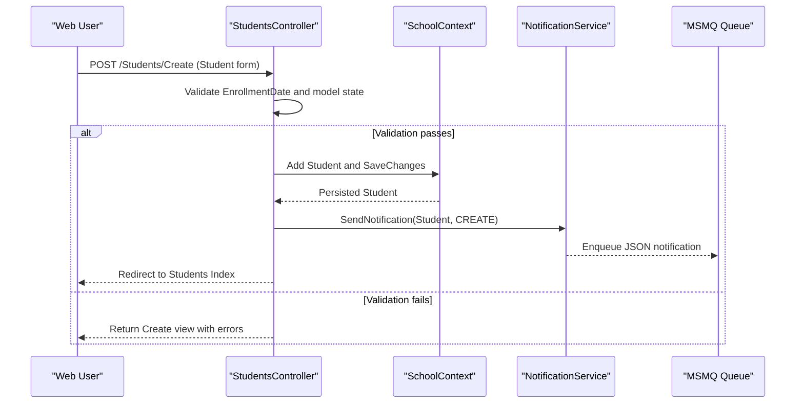

# API & Service Communication Contracts

The application exposes primarily MVC page endpoints plus a small JSON notification API. Communication is synchronous in-process controller-to-DbContext calls, with asynchronous notification delivery through MSMQ.

## Service Catalog

| Service | Port | Category | Purpose |
|---|---|---|---|
| `ContosoUniversity` (`ContosoUniversity.csproj`) | IIS Express HTTPS 44300 | API Layer | Main web application providing MVC pages and JSON endpoints |
| SQL Server LocalDB (`DefaultConnection`) | Local DB engine | Infrastructure | Persistence for academic and notification entities |
| MSMQ Private Queue (`NotificationQueuePath`) | Local machine private queue | Infrastructure | Event-style notification transport for CRUD activity |

## API Endpoints Inventory

| Service | Method | Path | Request Type | Response Type |
|---|---|---|---|---|
| ContosoUniversity (`HomeController`) | GET | `/Home/Index` | None | HTML view |
| ContosoUniversity (`StudentsController`) | GET | `/Students/Index` | Query params (`sortOrder`, `searchString`, `page`) | HTML view with paginated students |
| ContosoUniversity (`StudentsController`) | POST | `/Students/Create` | Form body mapped to `Student` | Redirect or validation errors |
| ContosoUniversity (`CoursesController`) | POST | `/Courses/Create` | Form body mapped to `Course` + file upload | Redirect or validation errors |
| ContosoUniversity (`DepartmentsController`) | POST | `/Departments/Edit` | Form body mapped to `Department` + concurrency token | Redirect or concurrency error view |
| ContosoUniversity (`InstructorsController`) | POST | `/Instructors/Edit/{id}` | Form body + selected course IDs | Redirect or validation errors |
| ContosoUniversity (`NotificationsController`) | GET | `/Notifications/GetNotifications` | None | JSON payload `{ success, notifications, count }` |
| ContosoUniversity (`NotificationsController`) | POST | `/Notifications/MarkAsRead` | `id` parameter | JSON payload `{ success }` |

## Management & Observability Endpoints

| Service | Endpoint | Custom Metrics |
|---|---|---|
| ContosoUniversity | No dedicated `/health` or `/swagger` endpoints detected | None detected |

## DTOs & Contracts

Primary contract models include domain entities (`Student`, `Instructor`, `Course`, `Department`, `Enrollment`, `Notification`) used directly in MVC model binding. View-model contracts include `InstructorIndexData`, `AssignedCourseData`, and `EnrollmentDateGroup` for read composition in views. JSON contracts in `NotificationsController` are anonymous response objects containing `success`, notification collection, and count values; no OpenAPI/Swagger, protobuf, or GraphQL schema was found.

## Communication Patterns

The application uses synchronous server-side communication where controllers call EF Core through a shared `SchoolContext` to fetch and persist data. A secondary asynchronous pattern exists for audit-style events: controllers call `NotificationService`, which serializes `Notification` payloads and sends them to a local MSMQ private queue; `GetNotifications` consumes queue messages in batches. No circuit breaker, retry policy, service discovery, or API gateway pattern is configured. Security posture at API level is minimal: no global authentication filter is enabled and controllers generally operate without `[Authorize]` enforcement or TLS termination settings beyond local IIS Express development configuration.

## Service Technology Matrix

| Service | Web | Data Access | Discovery | Gateway | Actuator | Cache | Metrics |
|---|---|---|---|---|---|---|---|
| ContosoUniversity | ASP.NET MVC 5 | EF Core 3.1 + SQL Server | None | None | None | Not explicitly wired in code paths | None |

## Service Communication Sequence

