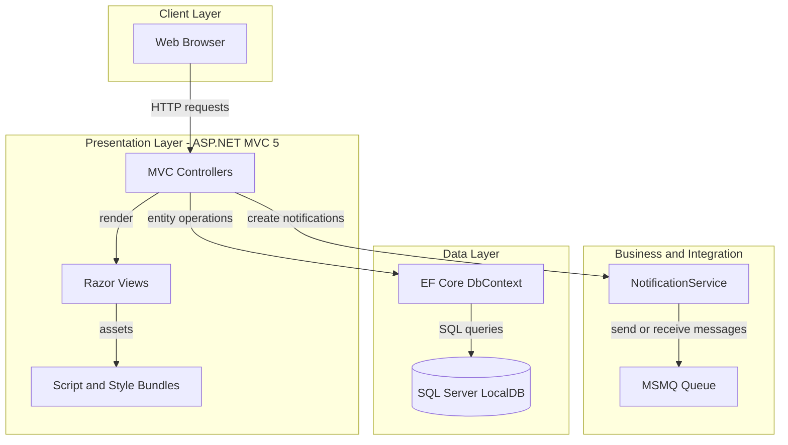
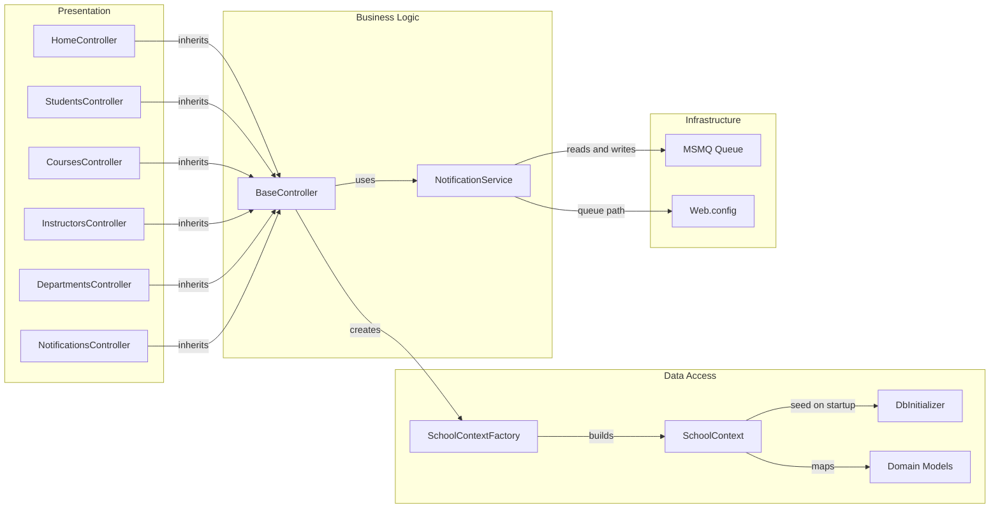

# Architecture Diagram

This repository contains a single ASP.NET MVC monolith that serves server-rendered pages and persists university domain data in SQL Server via Entity Framework Core.

## Application Architecture

### Technology Stack Summary

| Layer | Technology | Version | Purpose |
|---|---|---|---|
| Presentation | ASP.NET MVC | 5.2.9 | Server-side MVC web framework |
| UI Rendering | Razor / System.Web.WebPages | 3.2.9 | HTML view rendering |
| Data Access | Entity Framework Core | 3.1.32 | ORM and relationship mapping |
| Database | SQL Server (LocalDB connection) | N/A | Persistent storage for academic entities |
| Messaging | System.Messaging (MSMQ) | .NET Framework API | Internal notification queue |

### Data Storage & External Services

The application uses a single SQL Server LocalDB connection (`DefaultConnection`) for all university entities and uses Microsoft Message Queue (MSMQ) as a local integration channel for CRUD event notifications. No external SaaS APIs or cloud brokers are configured in this project.

### Key Architectural Decisions

- Uses a single monolithic MVC application with shared `SchoolContext` rather than splitting domain capabilities into deployable services.
- Uses table-per-hierarchy inheritance (`Person` -> `Student` / `Instructor`) and seeded startup initialization (`DbInitializer.Initialize`) for baseline data.
- Emits CRUD notifications to MSMQ through `NotificationService` from a shared `BaseController` helper.

## Component Relationships

### Component Inventory

| Component | Layer | Type | Responsibility |
|---|---|---|---|
| `HomeController` | Presentation | MVC Controller | Dashboard and informational pages |
| `StudentsController` | Presentation | MVC Controller | Student CRUD, filtering, pagination |
| `CoursesController` | Presentation | MVC Controller | Course CRUD and teaching material upload |
| `InstructorsController` | Presentation | MVC Controller | Instructor CRUD and course assignment mapping |
| `DepartmentsController` | Presentation | MVC Controller | Department CRUD and concurrency-managed updates |
| `NotificationsController` | Presentation | MVC + JSON endpoints | Notification retrieval and read operations |
| `BaseController` | Business | Abstract controller base | Shared `SchoolContext` and notification dispatch wrapper |
| `NotificationService` | Business | Service | Serialize and route entity events to MSMQ |
| `SchoolContext` | Data Access | EF Core `DbContext` | Entity mapping, relationships, and persistence operations |
| `DbInitializer` | Data Access | Seed component | Ensures DB creation and initial reference data |
