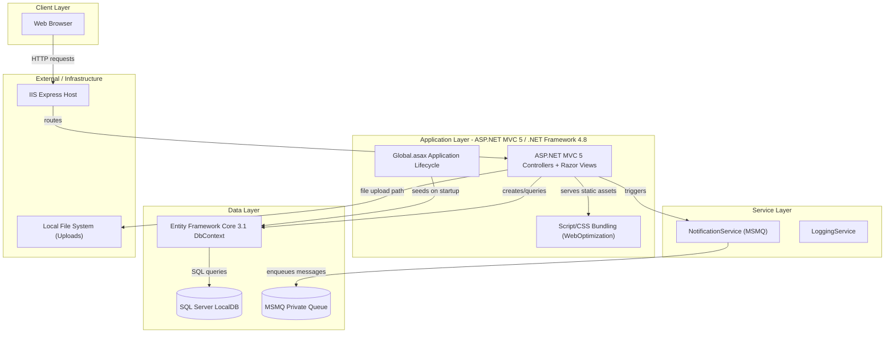
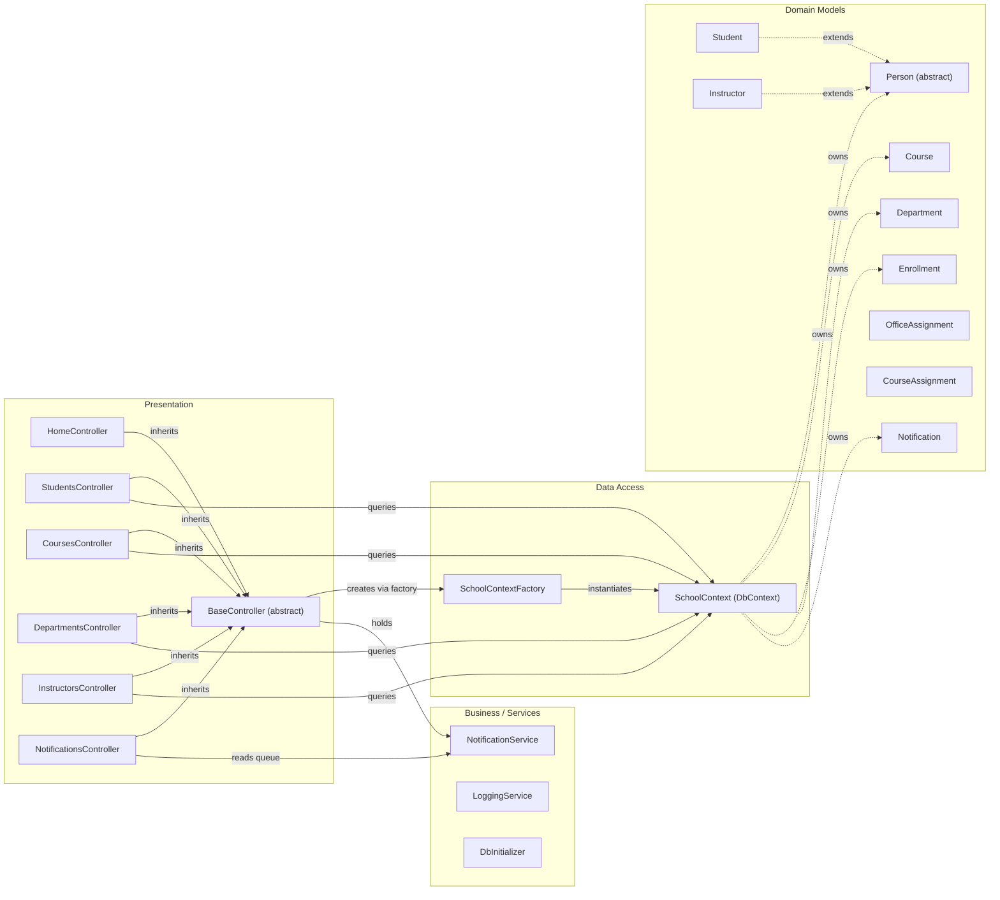

# Architecture Diagram

ContosoUniversity is a legacy ASP.NET MVC 5 web application targeting .NET Framework 4.8, implementing a university management system with server-side rendered views and a SQL Server database accessed via Entity Framework Core.

## Application Architecture

### Technology Stack Summary

| Layer | Technology | Version | Purpose |
|-------|-----------|---------|---------|
| Presentation | ASP.NET MVC | 5.2.9 | Server-side MVC web framework |
| Presentation | Razor Views | 3.2.9 | HTML templating engine |
| Presentation | Bootstrap | 5.3.3 | CSS/UI framework |
| Presentation | jQuery | 3.7.1 | Client-side scripting |
| Business Logic | C# / .NET Framework | 4.8 | Application runtime |
| Data Access | Entity Framework Core | 3.1.32 | ORM for SQL Server |
| Data Access | Microsoft.Data.SqlClient | 2.1.4 | SQL Server driver |
| Messaging | System.Messaging (MSMQ) | Windows built-in | Notification queue |
| Serialization | Newtonsoft.Json | 13.0.3 | JSON serialization |
| Security | Microsoft.Identity.Client | 4.21.1 | Identity library (unused in app) |
| Bundling | Microsoft.AspNet.Web.Optimization | 1.1.3 | CSS/JS bundling and minification |
| Host | IIS / IIS Express | — | Web server |

### Data Storage & External Services

The application uses a single SQL Server LocalDB instance (`ContosoUniversityNoAuthEFCore`) for all persistent data, accessed through Entity Framework Core 3.1 via the `SchoolContext` DbContext. File uploads (teaching material images for courses) are stored on the local server file system under `~/Uploads/TeachingMaterials/`. Notifications are dispatched asynchronously via a Windows MSMQ private queue (`.\Private$\ContosoUniversityNotifications`) and are also persisted to the `Notification` table in the database for the notifications dashboard.

### Key Architectural Decisions

- **Table-per-Hierarchy (TPH) inheritance**: `Student` and `Instructor` both extend the abstract `Person` class and are stored in a single `Person` table with a `Discriminator` column.
- **Hybrid ORM**: Entity Framework Core 3.1 is used as the ORM within a legacy ASP.NET MVC 5 / .NET Framework 4.8 project — a non-standard combination that limits cross-platform portability.
- **MSMQ for notifications**: Application-level change notifications (CREATE/UPDATE/DELETE) are published to an MSMQ queue, making the notification subsystem Windows-only and incompatible with cloud hosting without replacement.

## Component Relationships

### Component Inventory

| Component | Layer | Type | Responsibility |
|-----------|-------|------|----------------|
| BaseController | Presentation | Abstract MVC Controller | Provides shared `SchoolContext`, `NotificationService`, and `SendEntityNotification` helper |
| StudentsController | Presentation | MVC Controller | CRUD for students with pagination and search |
| CoursesController | Presentation | MVC Controller | CRUD for courses including file upload for teaching materials |
| DepartmentsController | Presentation | MVC Controller | CRUD for departments with instructor assignment |
| InstructorsController | Presentation | MVC Controller | CRUD for instructors with office assignment and course management |
| NotificationsController | Presentation | MVC Controller | JSON API for reading/managing notifications from MSMQ queue |
| HomeController | Presentation | MVC Controller | Dashboard showing enrollment statistics by date |
| SchoolContext | Data Access | EF Core DbContext | Defines all DbSets, model configuration (TPH, composite keys, relationships) |
| SchoolContextFactory | Data Access | Static Factory | Reads connection string from ConfigurationManager and creates SchoolContext |
| DbInitializer | Data Access | Static Utility | Seeds initial data (students, instructors, departments, courses) |
| NotificationService | Services | Service Class | Sends/receives notifications via MSMQ; serializes to JSON |
| LoggingService | Services | Service Class | Application-level logging wrapper |
| Person | Domain Model | Abstract Entity | Base class for Student and Instructor (TPH) |
| Student | Domain Model | Entity | Represents a student with enrollment date and enrollments |
| Instructor | Domain Model | Entity | Represents an instructor with hire date, office, and course assignments |
| Course | Domain Model | Entity | Academic course with title, credits, department, and teaching material |
| Department | Domain Model | Entity | Academic department with budget, start date, and administrator |
| Enrollment | Domain Model | Entity | Many-to-many join between Student and Course with optional grade |
| CourseAssignment | Domain Model | Entity | Many-to-many join between Course and Instructor |
| OfficeAssignment | Domain Model | Entity | One-to-one relationship with Instructor for office location |
| Notification | Domain Model | Entity | Persisted notification record with entity type, operation, and read status |
