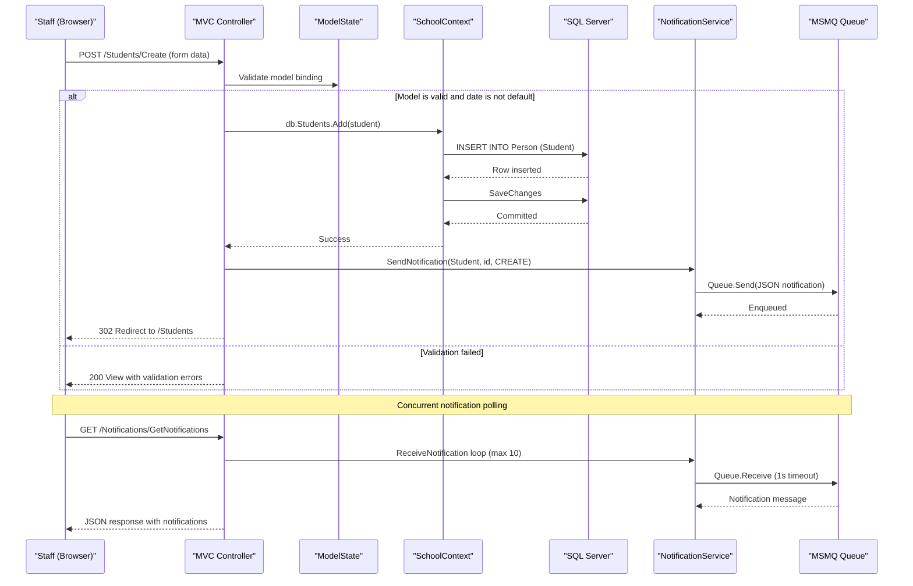

# Core Business Workflows

ContosoUniversity is a university administration web application that manages the academic lifecycle: students enroll in courses, instructors teach courses within departments, and all changes are tracked via an internal notification system.

## Domain Entities

| Entity | Service / Bounded Context | Description | Key Relationships |
|--------|--------------------------|-------------|-------------------|
| Student | Academic Records | A person enrolled at the university | Has many Enrollments; inherits from Person |
| Instructor | Faculty Management | A person employed to teach courses | Has many CourseAssignments; may have one OfficeAssignment; inherits from Person |
| Course | Curriculum Management | An academic course with title, credits, and department | Belongs to one Department; has many Enrollments; taught by many Instructors (via CourseAssignment) |
| Department | Organizational | An academic department with budget and administrator | Administrated by one Instructor; contains many Courses |
| Enrollment | Academic Records | Records a student's participation in a course with an optional grade | Belongs to Student and Course |
| CourseAssignment | Faculty Management | Assigns an Instructor to teach a Course | Join entity for the many-to-many Instructor-Course relationship |
| OfficeAssignment | Faculty Management | Records an Instructor's physical office location | One-to-one with Instructor |
| Notification | System Operations | An audit record of entity changes (CREATE/UPDATE/DELETE) | Created by all business operations |

## Service-to-Domain Mapping

This is a monolithic application — all domain entities are owned by a single deployable unit.

| Service | Domain Context | Owned Entities | External Dependencies |
|---------|---------------|----------------|----------------------|
| ContosoUniversity Web App | University Management (all) | Student, Instructor, Course, Department, Enrollment, CourseAssignment, OfficeAssignment, Notification | SQL Server LocalDB (EF Core), MSMQ (notifications) |

## Primary Workflows

### Workflow 1: Student Enrollment Management

A staff member navigates to the Students section to create, search, and manage student records.

**Steps:**
1. Staff navigates to `/Students` — paginated list is displayed (sorted by last name, page size 10)
2. Staff can filter by name using the search box (`/Students?searchString=...`)
3. Staff clicks **Create** → navigates to `/Students/Create`
4. Staff fills in LastName, FirstMidName, and EnrollmentDate; submits the form
5. Server validates: `ModelState.IsValid`, `EnrollmentDate` is not `DateTime.MinValue`
6. If valid: `db.Students.Add(student)` → `SaveChanges()` → `SendEntityNotification("Student", id, CREATE)` → MSMQ message enqueued → redirect to list
7. If invalid: form is returned with error messages
8. Staff can view details, edit, or delete any student

**Business rules involved:**
- EnrollmentDate must be a valid date (not default/min value)
- FirstName cannot exceed 50 characters
- LastName is required, max 50 characters
- Default EnrollmentDate pre-populated with today's date

### Workflow 2: Course Management with File Upload

Staff creates or edits a course and optionally uploads a teaching material image.

**Steps:**
1. Staff navigates to `/Courses/Create`
2. Staff fills in CourseID (manual, not auto-generated), Title, Credits, Department
3. Staff optionally selects a teaching material image file
4. Server validates:
   - `ModelState.IsValid` check
   - File extension must be `.jpg`, `.jpeg`, `.png`, `.gif`, or `.bmp`
   - File size must be ≤ 5 MB
5. If file provided and valid:
   - `Server.MapPath("~/Uploads/TeachingMaterials/")` resolves server path
   - Directory is created if it does not exist
   - File saved with name `course_{id}_{GUID}{ext}`
   - Path stored in `Course.TeachingMaterialImagePath`
6. Course saved to database, notification sent

### Workflow 3: Instructor Management with Course Assignment

Staff manages instructor records and their teaching assignments.

**Steps:**
1. Staff navigates to `/Instructors/Create` or `/Instructors/Edit/{id}`
2. Staff fills in LastName, FirstMidName, HireDate
3. Staff optionally assigns an office location (OfficeAssignment)
4. Staff selects courses to assign via a checkbox list (`selectedCourses[]`)
5. Server processes course assignments:
   - For Create: creates new `CourseAssignment` records for each selected course
   - For Edit: removes unselected assignments, adds new assignments (`UpdateInstructorCourses`)
6. Instructor saved with all assignments

### Workflow 4: Department Administration with Concurrency Control

Staff manages department budgets and instructor assignments, with optimistic concurrency.

**Steps:**
1. Staff opens Department Edit form (loads `RowVersion` as a hidden field)
2. Staff updates Name, Budget, StartDate, or Administrator
3. On save: EF Core sends UPDATE with WHERE `RowVersion = original_value`
4. If another user changed the record first → `DbUpdateConcurrencyException` is caught
5. Conflicting values are fetched from the database and displayed to the user with instructions to retry
6. If no conflict: change saved, notification sent

### Workflow 5: Notification Polling

The UI polls for change events to alert users of recent operations.

**Steps:**
1. Browser loads any page with the notification bar (JavaScript timer starts)
2. Every 30 seconds: `GET /Notifications/GetNotifications`
3. Server calls `NotificationService.ReceiveNotification()` in a loop (up to 10 messages, 1-second timeout each)
4. Server returns JSON `{success, notifications[], count}`
5. JavaScript updates the notification badge count and list

## Cross-Service Data Flows

This is a monolithic application — no cross-service data flows exist. All data is owned by the single `SchoolContext` and accessed within the same process. The only external data flow is:
- **Write path**: MSMQ message sent after each CREATE/UPDATE/DELETE operation
- **Read path**: MSMQ message consumed on-demand via the notification polling endpoint

## Business Workflow Sequence

## Business Rules & Decision Logic

### Validation Rules

| Entity | Field | Rule |
|--------|-------|------|
| Student | EnrollmentDate | Required; must not be `DateTime.MinValue`; must be between 1753-01-01 and 9999-12-31 |
| Student | LastName | Required, max 50 characters |
| Student | FirstMidName | Required, max 50 characters |
| Instructor | HireDate | Required; must be between 1753-01-01 and 9999-12-31 |
| Instructor | LastName, FirstMidName | Required, max 50 characters |
| Course | Title | Required, 3–50 characters |
| Course | Credits | Required, range 0–5 |
| Course | CourseID | Manual entry (no auto-generation); no range validation |
| Course | TeachingMaterialImagePath | Optional; if provided, must be max 255 characters |
| Course (upload) | File extension | Must be `.jpg`, `.jpeg`, `.png`, `.gif`, or `.bmp` |
| Course (upload) | File size | Must be ≤ 5 MB (5 × 1024 × 1024 bytes) |
| Department | Name | Required, 3–50 characters |
| Department | Budget | Currency type; no explicit range validation |
| Department | RowVersion | Optimistic concurrency token — mismatch triggers conflict resolution flow |
| Notification | EntityType | Required, max 100 characters |
| Notification | Message | Required, max 256 characters |

### Decision Logic

- **Instructor course assignment (Edit)**: The `UpdateInstructorCourses` helper compares the submitted `selectedCourses[]` array against the instructor's existing `CourseAssignments` collection and adds/removes entries to match.
- **Student search**: Case-insensitive `Contains()` filter on `LastName` OR `FirstMidName` fields.
- **Pagination reset**: If a new search string is provided, the page number resets to 1.
- **Grade display**: `Grade?` is nullable; `[DisplayFormat(NullDisplayText = "No grade")]` renders "No grade" for null values.

### Transactions

All database mutations use the default EF Core transaction scope — each `SaveChanges()` call is wrapped in an implicit transaction. No explicit `TransactionScope`, distributed transactions, or saga patterns are used.

### Error Handling

- **MSMQ send failure**: Caught silently with `Debug.WriteLine`; the main operation is not interrupted.
- **Concurrency conflict (Department)**: `DbUpdateConcurrencyException` is caught and re-presented to the user with both current and proposed values.
- **File upload error**: Caught and surfaced as a `ModelState` error on the `teachingMaterialImage` field.
- **Notification receive timeout**: `MessageQueueException` with `IOTimeout` error code is caught and returns `null` (no message available).

### Authorization

No authentication or role-based authorization is implemented. Code comments in several controller actions reference intended roles (e.g., "Admins and Teachers can view") but no `[Authorize]` attributes or claims-based checks are applied.
