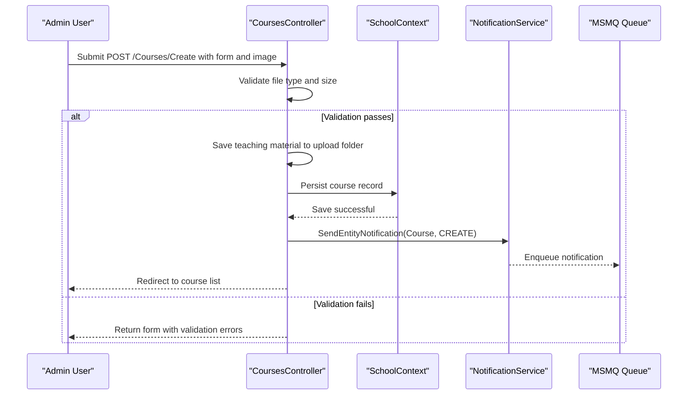

# Core Business Workflows

This application manages university academic administration workflows: maintaining students, instructors, courses, departments, enrollments, and operational notifications for record changes.

## Domain Entities

| Entity | Service / Bounded Context | Description | Key Relationships |
|---|---|---|---|
| Student | Academic Records | Learner managed by enrollment and profile workflows | Enrolls in many courses via `Enrollment` |
| Instructor | Academic Staffing | Faculty member assigned to departments and courses | Assigned to many courses; optional office assignment |
| Course | Curriculum Management | Course catalog item with credit and department ownership | Belongs to department; has enrollments and instructor assignments |
| Department | Administration | Organizational unit with budget and administrator | Owns courses; references administrator instructor |
| Enrollment | Registration | Student-to-course participation with optional grade | Links student and course |
| Notification | Operations Monitoring | Human-readable audit event of CRUD actions | Produced by controller operations and consumed by admin dashboard |

## Service-to-Domain Mapping

| Service | Domain Context | Owned Entities | External Dependencies |
|---|---|---|---|
| ContosoUniversity MVC app | Academic and administration | Student, Instructor, Course, Department, Enrollment, Notification | SQL Server LocalDB, MSMQ |

## Primary Workflows

### Workflow 1: Create or Update Student Record

1. User submits `Students/Create` or `Students/Edit` form.
2. Controller validates enrollment date rules and model state.
3. On success, entity changes are persisted through `SchoolContext`.
4. `SendEntityNotification` emits a CREATE or UPDATE notification.
5. User is redirected to the student list with refreshed data.

### Workflow 2: Manage Course with Teaching Material Upload

1. User opens course create or edit page and submits metadata plus optional file.
2. Controller validates file extension and size, then writes file under `Uploads/TeachingMaterials`.
3. Course changes are saved in the database.
4. Notification message is emitted to mark course create, update, or delete operations.

### Workflow 3: Maintain Instructor Assignments

1. User selects instructor and course assignments in edit flow.
2. Controller computes add/remove operations for the join mapping.
3. Changes are saved as course assignment updates.
4. Notification is produced for instructor update lifecycle events.

## Cross-Service Data Flows

The system is a single deployable service, so composition occurs within one process: controllers join and shape data from related entities (`InstructorIndexData`, enrollment summaries). Notification flow introduces asynchronous behavior where business events are published to MSMQ and later consumed by `NotificationsController` for dashboard display. If queue read fails, notification retrieval returns an error payload while core CRUD workflows remain available.

## Business Workflow Sequence

## Business Rules & Decision Logic

- Enrollment and hire dates are constrained to SQL Server-supported ranges.
- Course upload workflow enforces allowed image extensions and 5MB maximum payload size.
- Department update flow handles optimistic concurrency and prompts users with current database values on conflict.
- Instructor assignment workflow ensures join-table consistency by adding/removing `CourseAssignment` entries based on selected course IDs.
- Notification publishing is best-effort: failures are logged but do not block the primary transaction outcome.
