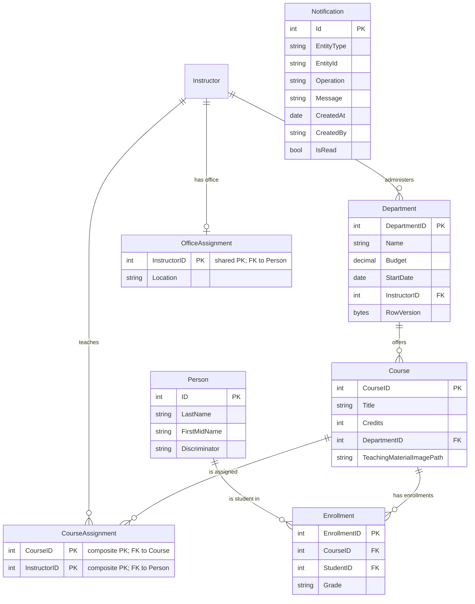

# Data Architecture & Persistence Layer

The data layer uses a single EF Core `DbContext` over SQL Server LocalDB and models core university entities with relational links, inheritance, and a small notification entity set.

## Database Configuration

| Service/Module | DB Type | Profile | Driver | Connection | Migration Tool |
|---|---|---|---|---|---|
| ContosoUniversity | SQL Server LocalDB | Default | `Microsoft.Data.SqlClient` | `DefaultConnection` in `Web.config` | No explicit migration tool; uses `EnsureCreated` seeding in `DbInitializer` |

## Data Ownership per Service

| Service | Tables Owned | ORM Framework | Caching | Notes |
|---|---|---|---|---|
| ContosoUniversity monolith | `Person`, `Course`, `Department`, `Enrollment`, `OfficeAssignment`, `CourseAssignment`, `Notification` | EF Core 3.1 | No explicit query/result caching flow configured | Single shared schema and context |

## Entity Model

## Key Repository Methods

| Service | Repository | Notable Methods | Purpose |
|---|---|---|---|
| ContosoUniversity | `SchoolContext` (`DbSet<T>`) | `Students.Include(...).Where(...).Single()`, `db.Entry(entity).State = Modified`, `SaveChanges()` | Core CRUD and relationship loading for MVC workflows |
| ContosoUniversity | `SchoolContext` + initialization | `Database.EnsureCreated()`, seed inserts in `DbInitializer.Initialize` | Bootstraps schema and sample records |
| ContosoUniversity | `NotificationService` queue access | `SendNotification`, `ReceiveNotification` | Persists event messages outside relational store |

## Caching Strategy

No explicit cache policy (cache-aside, distributed cache, or second-level EF cache) is configured in the code paths. `Microsoft.Extensions.Caching.Memory` packages are present, but active caching behavior is not wired into controller or data-access flows.

## Data Ownership Boundaries

The project uses a shared database model owned by one monolithic service, so there is no database-per-service boundary. All write paths run through the same `SchoolContext`, and reads are done directly against local `DbSet<T>` collections using EF Core query composition. Cross-module composition is in-process (controller + view model) rather than inter-service APIs.

### Data Classification & Sensitivity

| Entity | Sensitive Fields | Classification (PII/PHI/PCI/None) | Controls in Place |
|---|---|---|---|
| `Person` / `Student` / `Instructor` | `FirstMidName`, `LastName` | PII | No explicit field-level masking or encryption-at-rest configuration in repository |
| `Department` | Budget, administrator linkage | Internal | Concurrency token (`RowVersion`) only; no masking/encryption settings |
| `Notification` | `CreatedBy`, `Message` may contain user references | Internal/PII possible | Queue transport only; no explicit encryption/masking controls |
| `Enrollment`, `Course`, `CourseAssignment`, `OfficeAssignment` | No direct high-sensitivity fields detected | None/Internal | Standard relational controls only |
