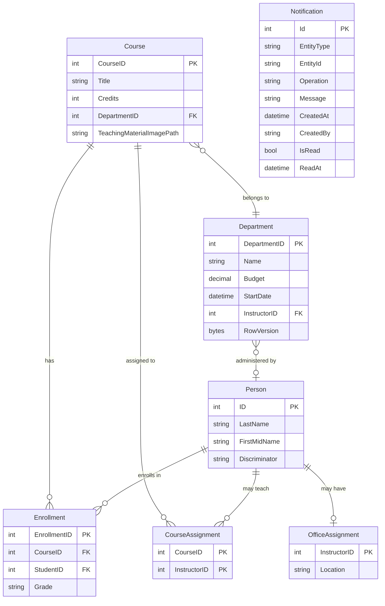

# Data Architecture & Persistence Layer

ContosoUniversity uses a single SQL Server LocalDB instance with 9 mapped entities accessed through Entity Framework Core 3.1, using Table-per-Hierarchy inheritance for the Person hierarchy and a composite primary key for the CourseAssignment join table.

## Database Configuration

| Service/Module | DB Type | Profile | Driver | Connection | Migration Tool |
|---------------|---------|---------|--------|------------|----------------|
| ContosoUniversity | SQL Server LocalDB | Default (all environments) | Microsoft.Data.SqlClient 2.1.4 | Data Source=(LocalDb)\MSSQLLocalDB; Initial Catalog=ContosoUniversityNoAuthEFCore; Integrated Security=True; MultipleActiveResultSets=True | EF Core EnsureCreated + DbInitializer seed |

Schema management: `Database.EnsureCreated()` is called at startup via `DbInitializer.Initialize()`. EF Core manages schema creation; there are no Flyway/Liquibase migration files. Seed data is inserted programmatically if the `Students` table is empty. Connection string is read from `Web.config` via `ConfigurationManager`. See `configuration-inventory.md` for property key details.

## Data Ownership per Service

| Service | Tables Owned | ORM Framework | Caching | Notes |
|---------|-------------|---------------|---------|-------|
| ContosoUniversity | Person, Course, Department, Enrollment, CourseAssignment, OfficeAssignment, Notification | Entity Framework Core 3.1 | None | Single shared database; EnsureCreated for schema; seed data via DbInitializer |

## Entity Model

**Notes on inheritance:**
- `Student` and `Instructor` both extend the abstract `Person` entity (TPH). `Student` adds `EnrollmentDate`; `Instructor` adds `HireDate`. Both map to the `Person` table with a `Discriminator` column.
- `CourseAssignment` has a composite PK (`CourseID` + `InstructorID`).
- `OfficeAssignment` uses the shared PK pattern (`InstructorID` is both PK and FK).

## Key Repository Methods

All data access is performed directly through `SchoolContext` (EF Core DbContext) in the controllers — there is no separate repository interface layer.

| Context | DbSet | Notable Access Patterns | Purpose |
|---------|-------|------------------------|---------|
| SchoolContext | Students | `.Include(s => s.Enrollments).ThenInclude(e => e.Course)` | Load student with full enrollment history |
| SchoolContext | Students | `.Where(s => s.LastName.Contains(q) \|\| s.FirstMidName.Contains(q))` | Full-name search |
| SchoolContext | Students | `PaginatedList<Student>.Create(query, page, pageSize)` | Server-side pagination (page size = 10) |
| SchoolContext | Courses | `.Include(c => c.Department)` | Eager-load department for course list |
| SchoolContext | Instructors | `.Include(i => i.OfficeAssignment).Include(i => i.CourseAssignments).ThenInclude(c => c.Course).ThenInclude(d => d.Department)` | Deep-load instructor with office, courses, and departments |
| SchoolContext | Departments | `.Include(d => d.Administrator)` | Load department with assigned administrator |
| SchoolContext | Enrollments | Direct query in instructor index for selected course | Load enrollments for a specific course |
| SchoolContext | Notifications | Saved indirectly via NotificationService; read via NotificationsController | Notification persistence |

`PaginatedList<T>` is a helper class (`PaginatedList.cs`) that wraps an `IQueryable<T>` and calculates page boundaries. It calls `.Count()` and `.Skip().Take()` to paginate server-side.

## Caching Strategy

No caching layer is configured or used in this application. While `Microsoft.Extensions.Caching.Memory` (v3.1.32) is referenced in `packages.config`, there are no `IMemoryCache` injections, `[ResponseCache]` attributes, or cache-related configuration in any controller or service. All database queries execute on every request without result caching.

## Data Ownership Boundaries

**Shared data store:** The entire application uses a single shared SQL Server LocalDB database. There is no database-per-service or logical schema separation.

**Cross-service access:** N/A — this is a monolithic application. All entities are accessed by all controllers through the single `SchoolContext` instance created per-request via `SchoolContextFactory.Create()`.

**Read/write patterns:** Predominantly read-heavy (list/detail views) with full CRUD operations on all entities. Optimistic concurrency is implemented only for `Department` via the `RowVersion` byte array (`[Timestamp]` attribute) — a `DbUpdateConcurrencyException` is caught in the Edit action and surfaced to the user.

### Data Classification & Sensitivity

| Entity | Sensitive Fields | Classification | Controls in Place |
|--------|----------------|----------------|-------------------|
| Person (Student/Instructor) | LastName, FirstMidName | PII (personal name) | None — no encryption-at-rest, no masking, no field-level access control |
| Student | EnrollmentDate | PII (educational record) | None |
| Instructor | HireDate | PII (employment record) | None |
| OfficeAssignment | Location | Internal only | None |
| Department | Budget, StartDate | Internal financial | None |
| Enrollment | Grade | PII (educational record / FERPA) | None — grades stored in plaintext with no access control |
| Notification | Message, CreatedBy | Internal audit | None |

No encryption-at-rest, data masking, field-level access controls, or audit logging are configured. Student grades and personally identifiable information (names, enrollment dates, hire dates) are stored in plaintext in a local development database. Before cloud deployment, PII/FERPA compliance controls should be evaluated and implemented.
