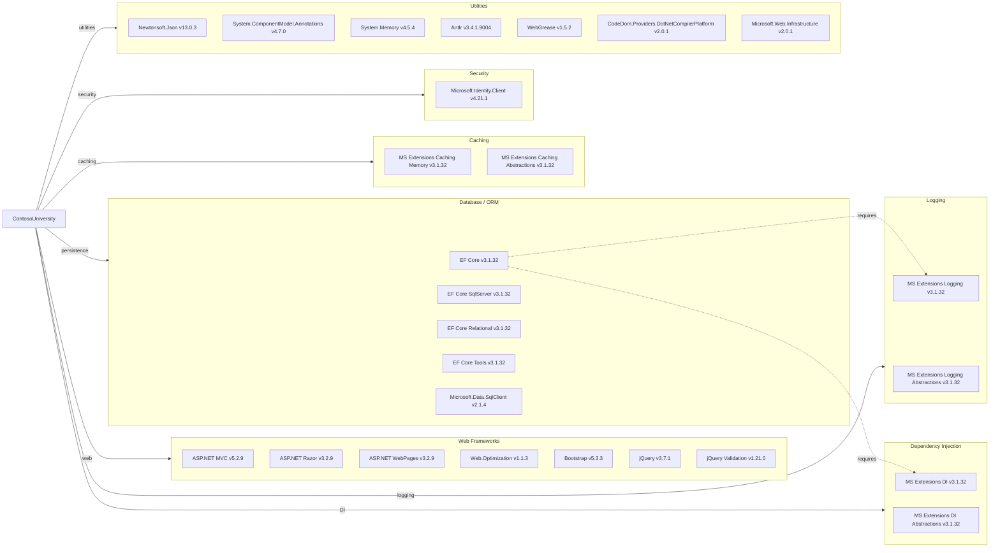

# Dependency Map

ContosoUniversity declares 44 NuGet packages (via packages.config) targeting .NET Framework 4.8, centered on ASP.NET MVC 5, Entity Framework Core 3.1, and Windows-specific messaging (System.Messaging via MSMQ).

## Dependencies

### Dependency Summary

| Category | Count | Key Libraries | Notes |
|----------|-------|---------------|-------|
| Web Frameworks | 7 | ASP.NET MVC 5.2.9, Razor 3.2.9, Bootstrap 5.3.3, jQuery 3.7.1 | Legacy System.Web-based MVC stack on .NET Framework |
| Database / ORM | 5 | EF Core 3.1.32, EF Core SqlServer 3.1.32, Microsoft.Data.SqlClient 2.1.4 | EF Core 3.1 is end-of-life (support ended Dec 2022) |
| Dependency Injection | 2 | Microsoft.Extensions.DependencyInjection 3.1.32 | Not used as IoC container; DI is manual via constructors |
| Logging | 2 | Microsoft.Extensions.Logging 3.1.32 | Logging abstractions present but no concrete provider wired |
| Caching | 2 | Microsoft.Extensions.Caching.Memory 3.1.32 | Caching assemblies referenced but not actively used in code |
| Security | 1 | Microsoft.Identity.Client 4.21.1 | MSAL library present but authentication not implemented |
| Utilities | 7 | Newtonsoft.Json 13.0.3, System.ComponentModel.Annotations 4.7.0, Antlr 3.4.1 | Mixed bag of runtime and tooling utilities |

### Version & Compatibility Risks

The most significant risk is the entire stack targeting **.NET Framework 4.8** — a maintenance-mode runtime that is Windows-only and cannot be containerized on Linux. **Entity Framework Core 3.1** reached end-of-life in December 2022 and must be upgraded to EF Core 8+ for cloud migrations. **ASP.NET MVC 5.2.9** is a System.Web-based framework that has no direct equivalent in .NET Core/5+; migration requires rewriting controllers using ASP.NET Core MVC. **System.Messaging** (MSMQ, used implicitly via NotificationService) is not declared in packages.config because it ships with Windows; it is unavailable on Linux or in Azure App Service without a complete messaging replacement. **Microsoft.Identity.Client 4.21.1** is present but authentication is not implemented — this will need to be properly wired before cloud deployment.

### Notable Observations

- **MSMQ dependency not in packages.config**: `System.Messaging` is consumed directly from the Windows GAC (Global Assembly Cache), making the dependency invisible to NuGet tooling. This creates an undeclared Windows-only runtime requirement.
- **EF Core 3.1 in a .NET Framework project**: Mixing EF Core (a cross-platform ORM) with the legacy ASP.NET stack is unusual. The ORM upgrade path to EF Core 8+ is relatively straightforward, but it requires the overall project to migrate to ASP.NET Core first.
- **Microsoft.Identity.Client present but unused**: MSAL is listed in packages.config but there is no authentication/authorization code in any controller or startup class, suggesting authentication was planned but not implemented.
- **CSS/JS bundles**: Bootstrap 5.3.3 and jQuery 3.7.1 are delivered as NuGet packages and bundled via System.Web.Optimization — an approach that will not work in ASP.NET Core where npm/CDN is preferred.

## Test Dependencies

No test projects or test-scoped dependencies were detected in this repository.

Total test-scope dependencies: 0
No unit test or integration test projects were found. Adding a test project with xUnit/MSTest and EF Core in-memory provider is recommended before migration.
