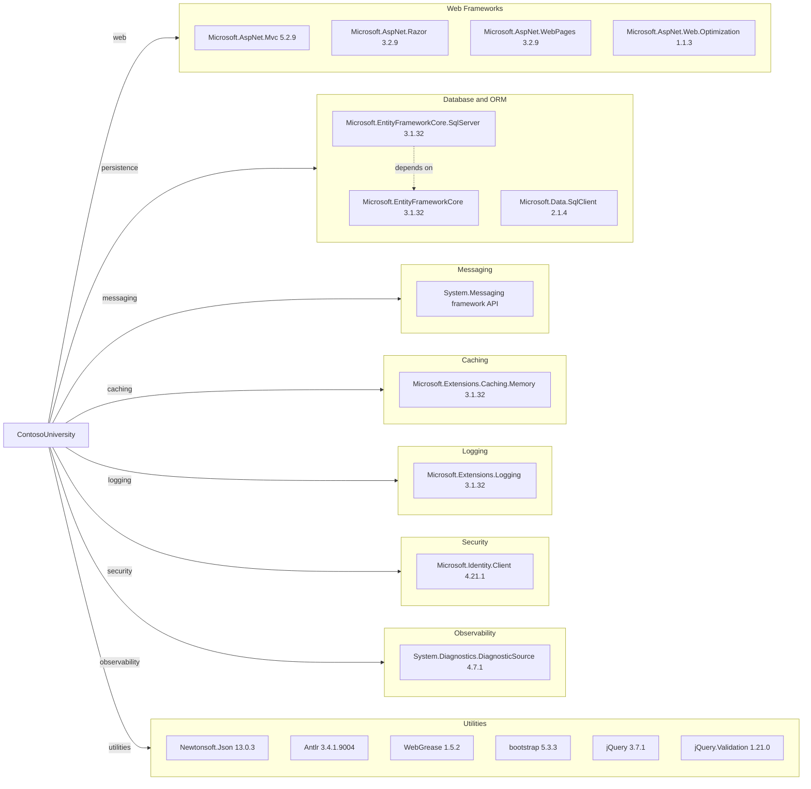

# Dependency Map

This .NET Framework web application declares approximately 38 NuGet dependencies spanning MVC web UI, EF Core-based persistence, Microsoft extensions, and client-side assets.

## Dependencies

### Dependency Summary

| Category | Count | Key Libraries | Notes |
|---|---:|---|---|
| Web Frameworks | 4 | ASP.NET MVC 5.2.9, Razor 3.2.9 | Legacy ASP.NET MVC stack on .NET Framework |
| Database / ORM | 3 | EF Core 3.1.32, EF Core SQL Server 3.1.32, Microsoft.Data.SqlClient 2.1.4 | ORM is out of support generation and tied to SQL Server |
| Messaging | 1 | System.Messaging | Windows-specific queue integration |
| Caching | 1 | Microsoft.Extensions.Caching.Memory 3.1.32 | In-process cache abstraction present |
| Logging | 1 | Microsoft.Extensions.Logging 3.1.32 | Basic logging abstractions referenced |
| Security | 1 | Microsoft.Identity.Client 4.21.1 | Authentication library available but not enforced in controllers |
| Observability | 1 | DiagnosticSource 4.7.1 | Instrumentation primitives only |
| Utilities | 9+ | Newtonsoft.Json, Antlr, WebGrease, jQuery, bootstrap | Mix of server and front-end assets |

### Version & Compatibility Risks

The project targets .NET Framework 4.8 with ASP.NET MVC 5 and EF Core 3.1.x, all of which require migration effort for long-term modernization. Several dependencies (including EF Core 3.1 and older build pipeline libraries like WebGrease) are from older support tracks and may block straightforward upgrades without package replacement.

### Notable Observations

- Web and data stacks are mixed: ASP.NET MVC 5 with EF Core 3.1 on .NET Framework rather than ASP.NET Core.
- `System.Messaging` introduces a Windows-only runtime dependency that complicates Linux/container portability.
- Front-end package declarations include newer bootstrap/jQuery versions while bundled static script files in source include older variants.

## Test Dependencies

| Framework | Version | Notes |
|---|---|---|
| None detected | N/A | No test project or explicit test-scoped package references found |

Total test-scope dependencies: 0
No test dependencies detected.
