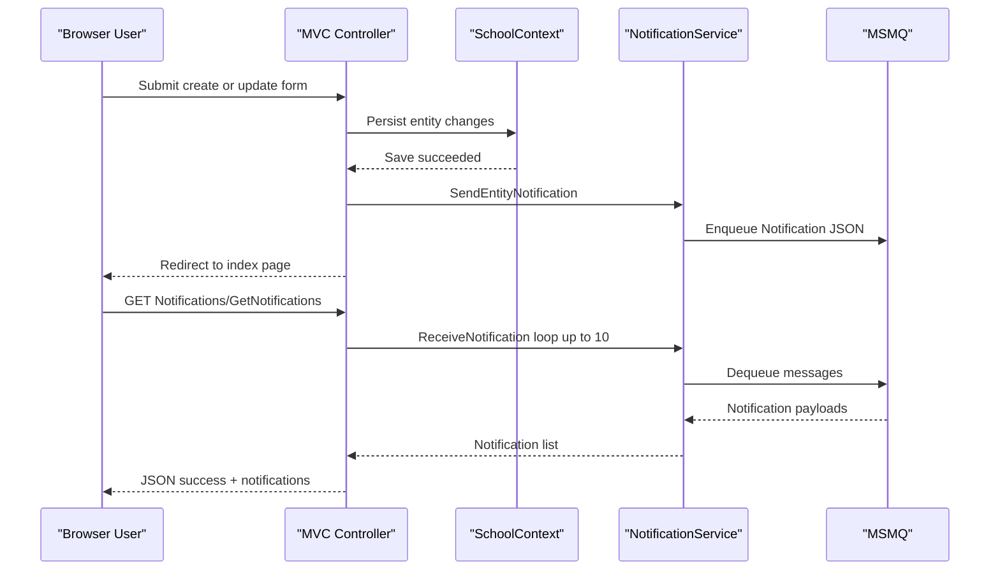

# API & Service Communication Contracts

The application exposes primarily MVC page endpoints plus a small JSON notification surface, with all communication handled synchronously in-process except for MSMQ-backed notification exchange.

## Service Catalog

| Service | Port | Category | Purpose |
|---|---:|---|---|
| ContosoUniversity (single web app) | 44300 (IIS Express URL) | Business | Serves UI flows and domain CRUD for university entities |
| Notification queue integration | Local private queue path | Infrastructure | Buffers entity-operation notifications via MSMQ |

## API Endpoints Inventory

| Service | Method | Path | Request Type | Response Type |
|---|---|---|---|---|
| ContosoUniversity | GET | /Students/Index | query: sortOrder/currentFilter/searchString/page | Razor View |
| ContosoUniversity | GET | /Students/Details/{id} | path: id | Razor View |
| ContosoUniversity | POST | /Students/Create | form-bound Student | redirect or validation View |
| ContosoUniversity | POST | /Students/Edit | form-bound Student | redirect or validation View |
| ContosoUniversity | POST | /Students/Delete | form path/body id | redirect |
| ContosoUniversity | GET | /Courses/Index | none | Razor View |
| ContosoUniversity | POST | /Courses/Create | form-bound Course + file upload | redirect or validation View |
| ContosoUniversity | POST | /Courses/Edit | form-bound Course + file upload | redirect or validation View |
| ContosoUniversity | POST | /Courses/Delete | form path/body id | redirect |
| ContosoUniversity | GET | /Instructors/Index | query: id/courseID | Razor View |
| ContosoUniversity | POST | /Instructors/Create | form-bound Instructor + selectedCourses[] | redirect or validation View |
| ContosoUniversity | POST | /Instructors/Edit | form id + selectedCourses[] | redirect or validation View |
| ContosoUniversity | POST | /Instructors/Delete | form path/body id | redirect |
| ContosoUniversity | GET | /Departments/Index | none | Razor View |
| ContosoUniversity | POST | /Departments/Create | form-bound Department | redirect or validation View |
| ContosoUniversity | POST | /Departments/Edit | form-bound Department (with RowVersion) | redirect or concurrency-handling View |
| ContosoUniversity | POST | /Departments/Delete | form path/body id | redirect |
| ContosoUniversity | GET | /Notifications/GetNotifications | none | JSON { success, notifications, count } |
| ContosoUniversity | POST | /Notifications/MarkAsRead | form/body id | JSON { success, message? } |

## Management & Observability Endpoints

| Service | Endpoint | Custom Metrics (if any) |
|---|---|---|
| ContosoUniversity | N/A | No dedicated health, metrics, or actuator endpoints identified |

## DTOs & Contracts

The app mostly uses domain entities (`Student`, `Course`, `Instructor`, `Department`, `Notification`) as request/response models in MVC binding and views. JSON contracts are centered on `Notification` objects returned by `GetNotifications`; immutable record-style DTOs were not identified. Serialization is handled with `Newtonsoft.Json` in notification queue payload creation and parsing.

## Communication Patterns

Synchronous communication dominates: browser requests hit MVC controllers, which call EF Core-backed data access directly through `SchoolContext`. Asynchronous behavior exists in notification workflows where controllers call `NotificationService`, which sends and receives messages from MSMQ. Circuit-breaker, retry, and timeout resilience frameworks are not explicitly configured at API contract level. Service discovery and gateway patterns are not present. Security posture at API level is limited: no global authorization filter is active and BaseController defaults notification user identity to `System`; TLS is implied for local IIS Express URL but broader production HTTPS/auth policies are not explicitly configured.

## Service Technology Matrix

| Service | Web | Data Access | Discovery | Gateway | Actuator | Cache | Metrics |
|---|---|---|---|---|---|---|---|
| ContosoUniversity | ASP.NET MVC 5 + Razor | EF Core DbContext + SQL Server | none | none | none | package present, not central | none |

## Service Communication Sequence

