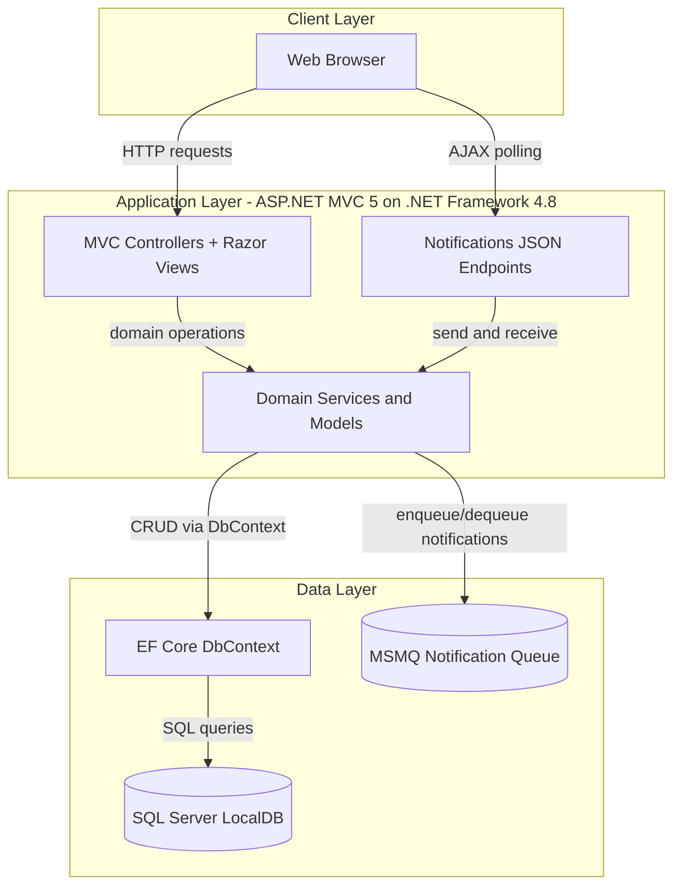
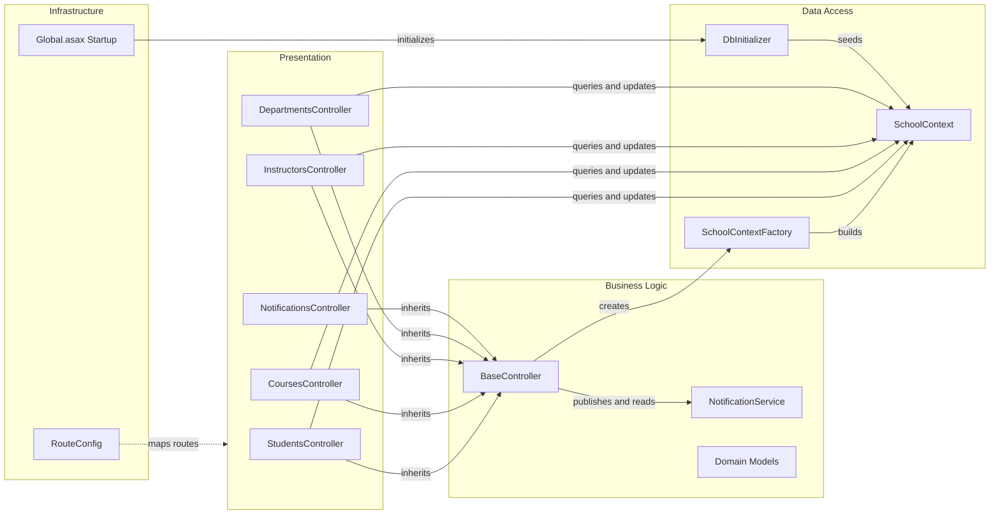

# Architecture Diagram

This application is a single deployable ASP.NET MVC web app that serves UI and API-like JSON endpoints, with Entity Framework Core handling data persistence to SQL Server.

## Application Architecture

### Technology Stack Summary

| Layer | Technology | Version | Purpose |
|---|---|---|---|
| Presentation | ASP.NET MVC + Razor | MVC 5.2.9 | Server-rendered UI and controller routing |
| Business | .NET Framework app services | .NET Framework 4.8 | Domain workflows for students, courses, instructors, departments |
| Data Access | Entity Framework Core + Microsoft.Data.SqlClient | EF Core 3.1.32 | ORM mapping and SQL Server data access |
| Integration | MSMQ + JSON serialization | System.Messaging / Newtonsoft.Json 13.0.3 | Notification queueing and payload exchange |

### Data Storage & External Services

The app persists academic and notification data in SQL Server LocalDB using a single DbContext. It also integrates with a local MSMQ private queue for notification delivery and dashboard polling; no external SaaS APIs are configured.

### Key Architectural Decisions

- Uses one monolithic MVC application with controller-driven server rendering and shared DbContext access.
- Implements TPH inheritance for `Person` with `Student` and `Instructor` discriminator values.
- Adds asynchronous-style notification behavior through MSMQ without introducing a separate service deployment.

## Component Relationships

### Component Inventory

| Component | Layer | Type | Responsibility |
|---|---|---|---|
| StudentsController | Presentation | MVC Controller | Student listing, filtering, paging, and CRUD workflows |
| CoursesController | Presentation | MVC Controller | Course CRUD and teaching material upload handling |
| InstructorsController | Presentation | MVC Controller | Instructor CRUD plus course assignment management |
| DepartmentsController | Presentation | MVC Controller | Department CRUD with optimistic concurrency handling |
| NotificationsController | Presentation | MVC Controller + JSON endpoints | Notification retrieval and mark-as-read operations |
| BaseController | Business Logic | Abstract controller base | Shared DbContext lifecycle and notification publishing hooks |
| NotificationService | Business Logic | Service | MSMQ message creation, queue polling, and serialization |
| SchoolContext | Data Access | EF Core DbContext | Entity sets, relationships, and model configuration |
| DbInitializer | Data Access | Seed initializer | Creates and seeds baseline academic data |
| RouteConfig | Infrastructure | Routing config | Registers default MVC route pattern |
