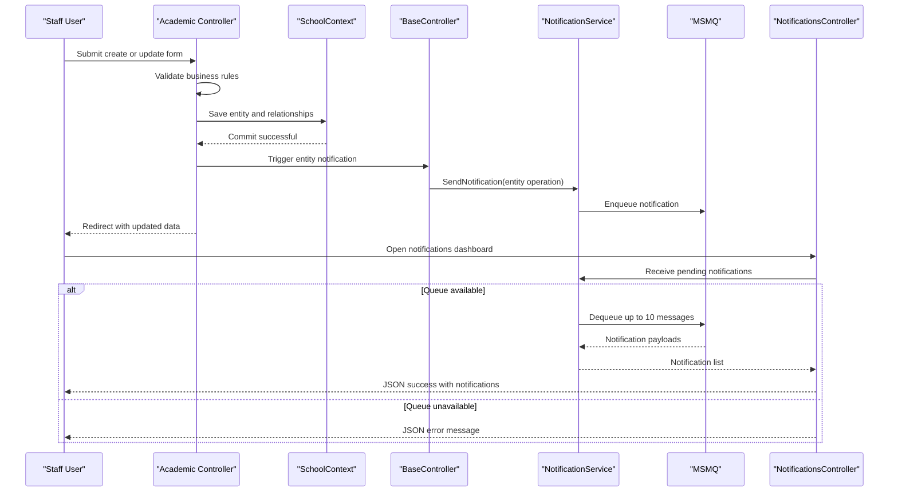

# Core Business Workflows

The application manages a university domain where staff maintain students, courses, instructors, and departments, while receiving operational notifications on entity changes.

## Domain Entities

| Entity | Service / Bounded Context | Description | Key Relationships |
|---|---|---|---|
| Student | Academic Administration | Learner profile and enrollment ownership | Inherits Person; linked to Enrollment |
| Instructor | Academic Administration | Faculty profile responsible for courses/departments | Inherits Person; linked to CourseAssignment and OfficeAssignment |
| Course | Curriculum Management | Course catalog record with credits and department | Belongs to Department; linked to Enrollments and Instructors |
| Department | Organization Management | Academic unit with budget and administrator | Owns Courses; references Instructor admin |
| Enrollment | Academic Administration | Student-course participation and grade outcome | Joins Student and Course |
| Notification | Operational Monitoring | Event message for entity create/update/delete | Produced by CRUD workflows and consumed by notification dashboard |

## Service-to-Domain Mapping

| Service | Domain Context | Owned Entities | External Dependencies |
|---|---|---|---|
| MVC Controllers (Students/Courses/Instructors/Departments) | Academic Administration | Student, Instructor, Course, Department, Enrollment | SchoolContext / SQL Server |
| NotificationsController + NotificationService | Operational Monitoring | Notification | MSMQ + Newtonsoft.Json |

## Primary Workflows

### Workflow 1: Manage Student Record

Staff opens the student list, filters/sorts/paginates, and then creates or edits a student. Controller validation ensures required name/date constraints before persisting via DbContext. On successful create/update/delete, the base controller publishes an entity-operation notification.

### Workflow 2: Maintain Course and Teaching Material

Staff creates or edits a course including title/credits/department and optional teaching material image upload. The course is validated, saved, and linked to its department. Entity-change notifications are emitted for downstream operational visibility.

### Workflow 3: Assign Instructors and Department Administration

Staff creates/updates instructors, assigns courses, and manages department administrators. The workflow updates join relationships (`CourseAssignment`) and handles office assignment details. Department edits include row-version concurrency behavior to protect against conflicting updates.

## Cross-Service Data Flows

The app is mostly in-process, but operational notifications cross a boundary via MSMQ. Academic CRUD controllers write to SQL and then enqueue notification payloads. The notifications dashboard polls queue-backed data and returns JSON for UI display; if queue read fails, the API returns an error payload without blocking primary academic transactions.

## Business Workflow Sequence

## Business Rules & Decision Logic

- Validation rules: course title length, credit range, required names, and date ranges for enrollment/hire dates.
- Decision logic: controllers branch on model validity and existence checks (id null/not found) before persisting or returning error views.
- State transitions: notifications progress from unread to read state conceptually; academic entities follow CRUD lifecycle changes.
- Data integrity: instructor-course assignments and department administration links are maintained through relationship updates; department edits apply row-version concurrency checks.
