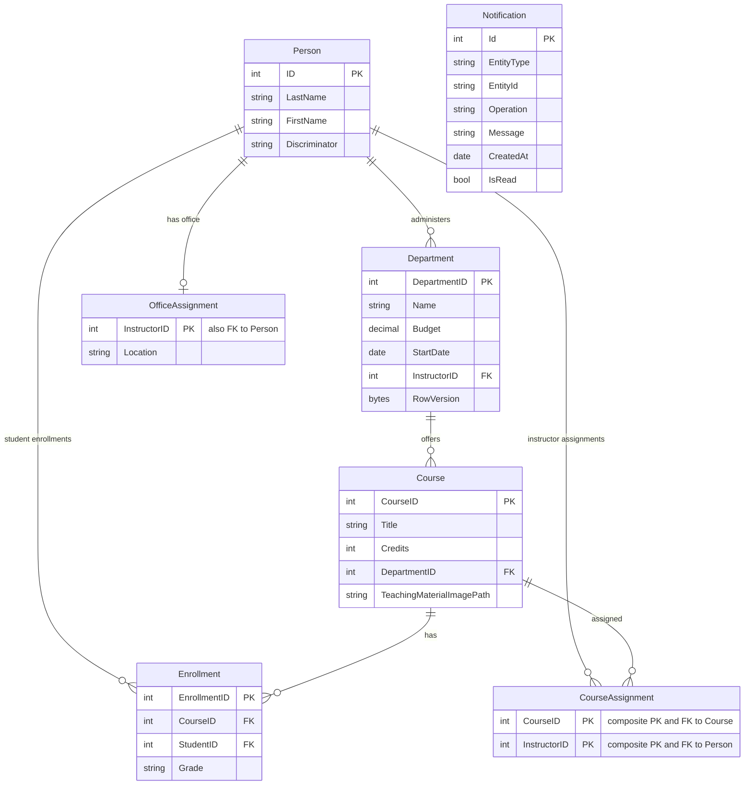

# Data Architecture & Persistence Layer

The data layer is implemented with a single EF Core DbContext over SQL Server LocalDB and models core university entities plus notification records.

## Database Configuration

| Service/Module | DB Type | Profile | Driver | Connection | Migration Tool |
|---|---|---|---|---|---|
| ContosoUniversity | SQL Server LocalDB | Default | Microsoft.Data.SqlClient | `DefaultConnection` in Web.config | EnsureCreated + DbInitializer seed (no explicit migration framework configured) |

## Data Ownership per Service

| Service | Tables Owned | ORM Framework | Caching | Notes |
|---|---|---|---|---|
| ContosoUniversity | Person, Course, Enrollment, Department, OfficeAssignment, CourseAssignment, Notification | EF Core 3.1 | No explicit active cache strategy in data access path | Single shared database owned by one monolith |

## Entity Model

## Key Repository Methods

| Service | Repository | Notable Methods | Purpose |
|---|---|---|---|
| ContosoUniversity | SchoolContext (DbContext) | `DbSet<T>` accessors for Courses/Students/Instructors/etc. | Central aggregate and query root for all entities |
| ContosoUniversity | DbInitializer | `Initialize(SchoolContext)` | Creates database and seeds baseline records |
| ContosoUniversity | Controller-level LINQ queries | `Include`, `AsNoTracking`, filtering/paging queries | Implements read and write data access patterns for MVC flows |

## Caching Strategy

No explicit distributed or query-result caching strategy is implemented in the data path. Memory caching packages are referenced but entity retrieval and persistence operations are performed directly against DbContext/SQL Server.

## Data Ownership Boundaries

This is a monolithic app with a shared relational store, so service-level ownership boundaries are logical rather than physical. Controllers and services access data through one DbContext and shared schema; cross-context data joins are handled by EF navigation loading and LINQ composition within the same process.

### Data Classification & Sensitivity

| Entity | Sensitive Fields | Classification (PII/PHI/PCI/None) | Controls in Place |
|---|---|---|---|
| Person (Student/Instructor) | FirstName, LastName | PII | Model validation present; no explicit masking/encryption-at-rest controls in app config |
| Department | Administrator link via InstructorID | Internal | Optimistic concurrency (`RowVersion`) |
| Notification | CreatedBy and message content | Internal/PII possible | No explicit masking policy detected |
| Course, Enrollment, OfficeAssignment, CourseAssignment | Academic metadata | None/Internal | Standard ORM persistence |
