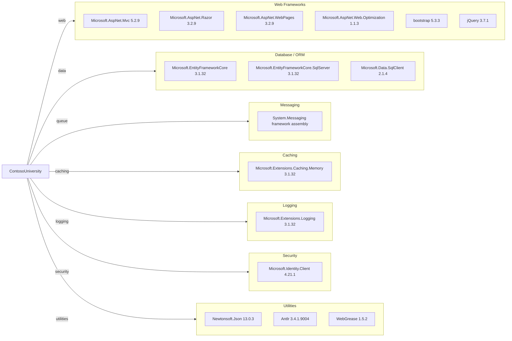

# Dependency Map

This project declares 40+ NuGet and web dependencies centered around ASP.NET MVC, EF Core, and SQL Server data access.

## Dependencies

### Dependency Summary

| Category | Count | Key Libraries | Notes |
|---|---:|---|---|
| Web Frameworks | 6 | ASP.NET MVC 5.2.9, Razor 3.2.9, bootstrap 5.3.3 | Legacy MVC stack on .NET Framework |
| Database / ORM | 3 | EF Core 3.1.32, SQLClient 2.1.4 | EF Core 3.1 is out of support |
| Messaging | 1 | System.Messaging | Windows-only MSMQ dependency |
| Caching | 1 | Microsoft.Extensions.Caching.Memory 3.1.32 | Package present, limited explicit usage |
| Logging | 1 | Microsoft.Extensions.Logging 3.1.32 | Base logging abstractions |
| Security | 1 | Microsoft.Identity.Client 4.21.1 | Identity client library included |
| Utilities | 3+ | Newtonsoft.Json, Antlr, WebGrease | Support and serialization dependencies |

### Version & Compatibility Risks

The app targets .NET Framework 4.8 and relies on ASP.NET MVC 5 and EF Core 3.1-era packages. EF Core 3.1 is end-of-support and MSMQ/System.Web dependencies are modernization constraints for Linux/container targets.

### Notable Observations

- `System.Web.*` and web application targets indicate classic ASP.NET pipeline coupling.
- EF Core packages are pinned at 3.1.32, creating upgrade pressure for newer .NET targets.
- `System.Messaging` introduces Windows platform affinity for notification features.
- Front-end libraries are split between NuGet-managed and static script assets.

## Test Dependencies

No test-scoped dependencies were detected in `packages.config` or the project file.

Total test-scope dependencies: 0

No dedicated test framework package references were found in this project.
