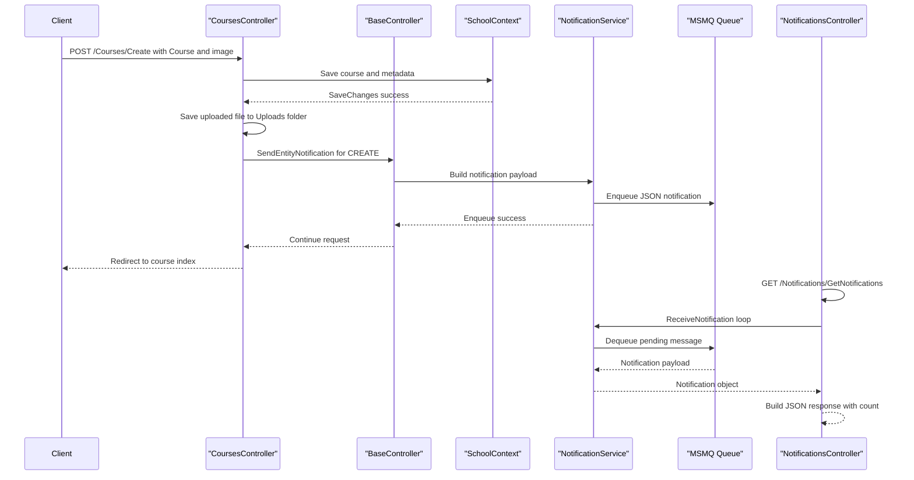

# API & Service Communication Contracts

This application exposes controller-based HTTP endpoints for UI and JSON interactions, with predominantly synchronous request handling and asynchronous notification queue messaging.

## Service Catalog

| Service | Port | Category | Purpose |
|---|---|---|---|
| ContosoUniversity.Web | IIS / IIS Express default | API Layer | Hosts MVC controllers, Razor views, and JSON endpoints |
| NotificationService (in-process) | N/A | Business | Produces and consumes notification messages for admin dashboard |
| SQL Server LocalDB | SQL default | Infrastructure | Stores relational university and notification records |
| MSMQ private queue | Windows queue path | Infrastructure | Carries notification events asynchronously |

## API Endpoints Inventory

| Service | Method | Path | Request Type | Response Type |
|---|---|---|---|---|
| StudentsController | GET | /Students/Index | Query: sortOrder, currentFilter, searchString, page | HTML view |
| StudentsController | POST | /Students/Create | Form-bound `Student` | Redirect/HTML view |
| StudentsController | POST | /Students/Edit | Form-bound `Student` | Redirect/HTML view |
| StudentsController | POST | /Students/Delete | Path/form `id` | Redirect |
| CoursesController | GET | /Courses/Index | None | HTML view |
| CoursesController | POST | /Courses/Create | Form-bound `Course` + `HttpPostedFileBase` | Redirect/HTML view |
| CoursesController | POST | /Courses/Edit | Form-bound `Course` + `HttpPostedFileBase` | Redirect/HTML view |
| CoursesController | POST | /Courses/Delete | Path/form `id` | Redirect |
| DepartmentsController | GET | /Departments/Index | None | HTML view |
| DepartmentsController | POST | /Departments/Create | Form-bound `Department` | Redirect/HTML view |
| DepartmentsController | POST | /Departments/Edit | Form-bound `Department` | Redirect/HTML view |
| DepartmentsController | POST | /Departments/Delete | Path/form `id` | Redirect |
| InstructorsController | GET | /Instructors/Index | Query: id, courseID | HTML view |
| InstructorsController | POST | /Instructors/Create | Form-bound `Instructor` + selectedCourses | Redirect/HTML view |
| InstructorsController | POST | /Instructors/Edit | Form-bound id + selectedCourses | Redirect/HTML view |
| InstructorsController | POST | /Instructors/Delete | Path/form `id` | Redirect |
| NotificationsController | GET | /Notifications/GetNotifications | None | JSON `{success, notifications, count}` |
| NotificationsController | POST | /Notifications/MarkAsRead | Form/body `id` | JSON `{success}` |

## Management & Observability Endpoints

| Service | Endpoint | Custom Metrics (if any) |
|---|---|---|
| ContosoUniversity.Web | No dedicated health endpoint detected | None detected |
| ContosoUniversity.Web | No dedicated metrics endpoint detected | None detected |
| ContosoUniversity.Web | Error page: /Home/Error | N/A |

## DTOs & Contracts

The API contract is primarily MVC model-binding based, with domain models (`Student`, `Course`, `Department`, `Instructor`, `Notification`) acting as request and response shapes for server-rendered pages and JSON payloads. `Notification` objects are serialized to JSON for queue transport and returned in notification API responses. No OpenAPI/Swagger specification, protobuf schema, or GraphQL schema files were detected.

## Communication Patterns

Synchronous communication is dominant: browser clients call MVC controller actions that interact with `SchoolContext` for database operations. Asynchronous communication occurs through MSMQ where entity change events are serialized and sent by `NotificationService`, then polled by `NotificationsController`. No service discovery, API gateway, or circuit breaker framework is configured. Security posture is minimal at API level: no explicit authentication/authorization attributes are enforced on controllers, and transport security configuration is not defined in-app.

## Service Technology Matrix

| Service | Web | Data Access | Discovery | Gateway | Actuator | Cache | Metrics |
|---|---|---|---|---|---|---|---|
| ContosoUniversity.Web | ASP.NET MVC 5 | EF Core + SqlClient | None | None | None | Memory caching libraries referenced | None detected |
| NotificationService | In-process service call | MSMQ + Notification table updates | None | None | None | None | None detected |

## Service Communication Sequence

