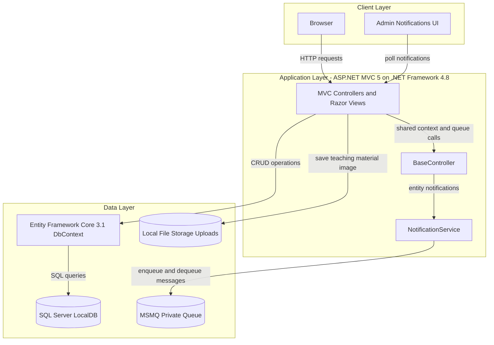
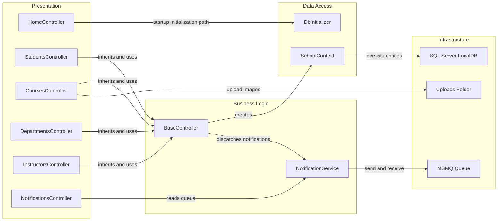

# Architecture Diagram

This document summarizes the current ContosoUniversity application architecture and key component relationships for modernization assessment.

## Application Architecture

### Technology Stack Summary

| Layer | Technology | Version | Purpose |
|---|---|---|---|
| Presentation | ASP.NET MVC + Razor | 5.2.9 / 3.2.9 | Server-rendered web UI and controller endpoints |
| Application | .NET Framework | 4.8 | Runtime for web application and controller logic |
| Data Access | Entity Framework Core | 3.1.32 | ORM and DbContext-based persistence |
| Database | SQL Server LocalDB | MSSQLLocalDB | Primary relational data store |
| Messaging | MSMQ | Windows MSMQ | Queue-based admin notification delivery |
| Storage | Local file system | N/A | Stores uploaded teaching material images |

### Data Storage & External Services

The application stores academic and notification data in SQL Server LocalDB through EF Core and uses a private MSMQ queue for asynchronous admin notifications. Course teaching material images are written to local file storage under `Uploads/TeachingMaterials`.

### Key Architectural Decisions

- Uses a classic ASP.NET MVC monolith with shared `BaseController` to centralize DbContext and notification behavior.
- Uses EF Core `DbContext` with table-per-hierarchy mapping for `Person` inheritance and explicit relationship configuration in `OnModelCreating`.
- Uses asynchronous-style notification flow via MSMQ while keeping synchronous CRUD for core academic entities.

## Component Relationships

### Component Inventory

| Component | Layer | Type | Responsibility |
|---|---|---|---|
| HomeController | Presentation | MVC Controller | Landing pages, static pages, and error views |
| StudentsController | Presentation | MVC Controller | Student listing, paging, and CRUD workflows |
| CoursesController | Presentation | MVC Controller | Course CRUD and teaching material upload handling |
| DepartmentsController | Presentation | MVC Controller | Department CRUD with concurrency handling |
| InstructorsController | Presentation | MVC Controller | Instructor CRUD and course assignment management |
| NotificationsController | Presentation | MVC Controller (JSON + View) | Admin notification polling and mark-as-read operations |
| BaseController | Business Logic | Shared controller base | Provides DbContext lifecycle and notification dispatch |
| NotificationService | Business Logic | Service | Publishes and consumes notification messages over MSMQ |
| SchoolContext | Data Access | EF Core DbContext | Entity mapping and persistence for university domain |
| DbInitializer | Data Access | Initializer | Creates database and seeds baseline data |
