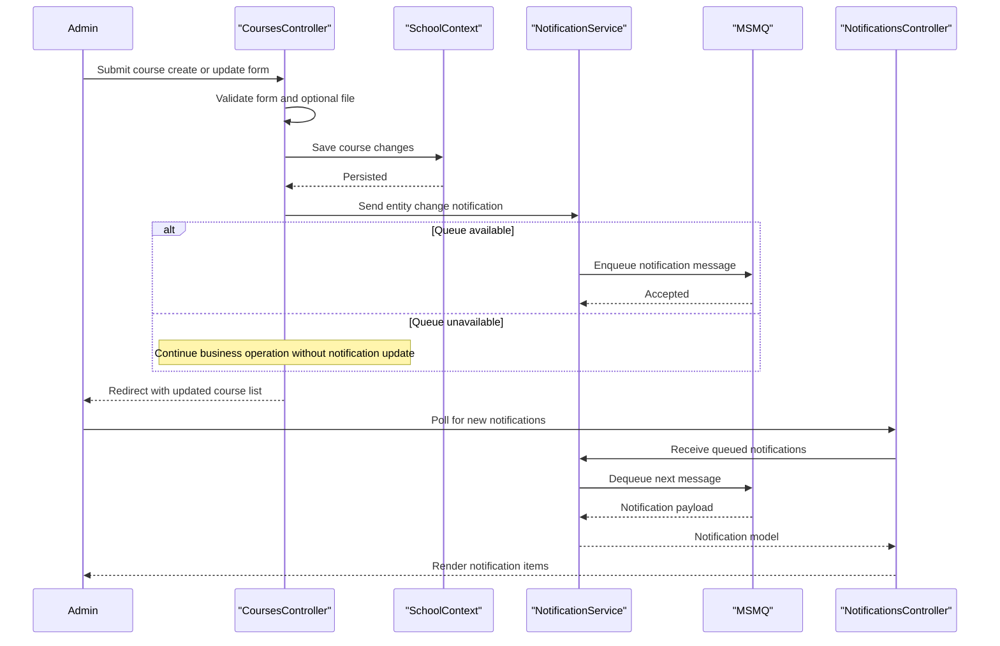

# Core Business Workflows

ContosoUniversity supports academic administration workflows for managing students, instructors, departments, and courses, with operational notifications for administrative visibility.

## Domain Entities

| Entity | Service / Bounded Context | Description | Key Relationships |
|---|---|---|---|
| Student | Academic Records | Learner profile and enrollment participant | Enrolls in many courses via Enrollment |
| Instructor | Academic Staffing | Teaching staff profile and teaching assignments | Teaches many courses; may own office assignment |
| Department | Academic Organization | Organizational unit responsible for courses and budget | Owns many courses; linked to administrator instructor |
| Course | Curriculum Management | Teachable course offering including credits and teaching material image | Belongs to department; relates to enrollments and instructors |
| Enrollment | Registration | Links students to courses and grading status | Many-to-one to student and course |
| Notification | Operations Monitoring | Tracks entity change events for admin dashboard | Produced from CRUD operations and queue events |

## Service-to-Domain Mapping

| Service | Domain Context | Owned Entities | External Dependencies |
|---|---|---|---|
| ContosoUniversity.Web Controllers | Academic administration | Student, Instructor, Department, Course, Enrollment, OfficeAssignment | SchoolContext, NotificationService |
| NotificationService | Operational notifications | Notification payload lifecycle | MSMQ private queue, Newtonsoft.Json |

## Primary Workflows

### Workflow 1: Manage course with teaching material upload

1. Staff submits create or edit course form from `CoursesController`.
2. Controller validates input and optional uploaded image extension and size.
3. Controller stores uploaded file into `Uploads/TeachingMaterials`.
4. Entity changes are persisted through `SchoolContext`.
5. Notification event is enqueued to notify admin users of the change.

### Workflow 2: Manage student lifecycle

1. Admin creates, updates, or deletes a student in `StudentsController`.
2. Model binding and validation gate invalid requests.
3. Student data is saved to SQL database through EF Core context.
4. Student change notification is generated and queued.

### Workflow 3: Monitor operational notifications

1. Admin opens notification dashboard (`Notifications/Index`).
2. Browser polls `Notifications/GetNotifications`.
3. Controller dequeues available notification messages.
4. Admin marks items as read via `Notifications/MarkAsRead`.

## Cross-Service Data Flows

Entity CRUD occurs in the web application and writes to SQL Server via EF Core. A secondary data flow emits notification messages to MSMQ after successful state changes; notifications are later consumed by the same application to present admin updates. If queue operations fail, the primary CRUD flow continues while notification visibility can degrade.

## Business Workflow Sequence

## Business Rules & Decision Logic

- CRUD operations only proceed when model validation passes; invalid model states return to edit/create views.
- Course image uploads accept only configured image extensions and size limits, preventing unsupported uploads.
- Department updates use row-version concurrency checks to prevent silent overwrite conflicts.
- Notification publishing is treated as a non-blocking side effect: exceptions in notification dispatch are logged without failing the primary entity transaction.
