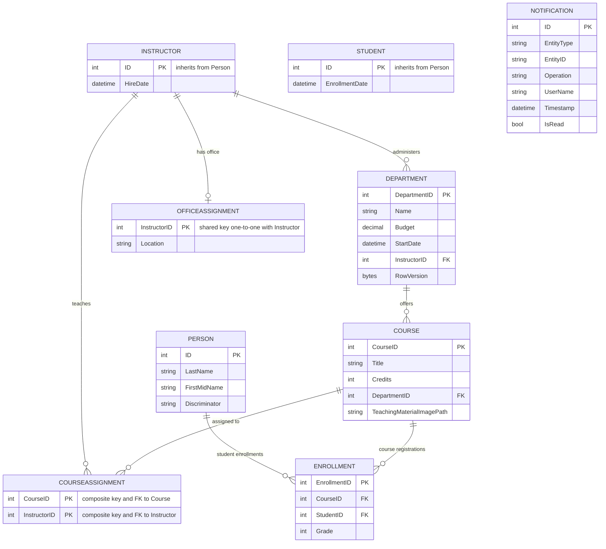

# Data Architecture & Persistence Layer

The data layer uses a single SQL Server relational database accessed through Entity Framework Core `SchoolContext`, with domain entities covering academic records and notifications.

## Database Configuration

| Service/Module | DB Type | Profile | Driver | Connection | Migration Tool |
|---|---|---|---|---|---|
| ContosoUniversity.Web | SQL Server LocalDB | Default | Microsoft.Data.SqlClient 2.1.4 | `DefaultConnection` from `Web.config` | None detected; `EnsureCreated` + seed initializer |

## Data Ownership per Service

| Service | Tables Owned | ORM Framework | Caching | Notes |
|---|---|---|---|---|
| ContosoUniversity.Web | Person, Student, Instructor, Department, Course, Enrollment, CourseAssignment, OfficeAssignment, Notification | EF Core 3.1 | None configured in code path | Single database owned by monolith |
| NotificationService | Notification queue payloads and read-state updates | N/A (queue + model persistence through shared context) | None | Uses MSMQ for transport and Notification entity for persistence state |

## Entity Model

## Key Repository Methods

| Service | Repository | Notable Methods | Purpose |
|---|---|---|---|
| ContosoUniversity.Web | `SchoolContext` (`Data/SchoolContext.cs`) | `DbSet<T>` accessors (`Students`, `Courses`, `Departments`, `Notifications`, etc.) | Aggregate root access to university entities |
| ContosoUniversity.Web | `DbInitializer` (`Data/DbInitializer.cs`) | `Initialize(SchoolContext context)` | Creates schema and seeds baseline reference data |
| NotificationService | `NotificationService` (`Services/NotificationService.cs`) | `SendNotification(...)`, `ReceiveNotification()`, `MarkAsRead(int)` | Queue transport and notification lifecycle operations |

## Caching Strategy

No active caching pattern is configured in runtime code paths. Although `Microsoft.Extensions.Caching.*` packages are declared, no `IMemoryCache` usage or cache-aside/read-through logic was detected in controllers or services.

## Data Ownership Boundaries

The system follows a shared single-database monolith model: all domain areas (students, instructors, departments, courses, enrollments, notifications) are persisted in the same SQL Server database via one DbContext. Cross-feature access is direct in-process object navigation and DbSet queries; no REST-based inter-service data access or CQRS split was detected.

### Data Classification & Sensitivity

| Entity | Sensitive Fields | Classification (PII/PHI/PCI/None) | Controls in Place |
|---|---|---|---|
| Person (base for Student/Instructor) | FirstMidName, LastName | PII | No explicit field-level masking or encryption controls in code |
| Notification | UserName, EntityDisplayName | PII | No explicit field-level masking or encryption controls in code |
| Department, Course, Enrollment, OfficeAssignment | Academic/operational data | None | Standard DB persistence only |
