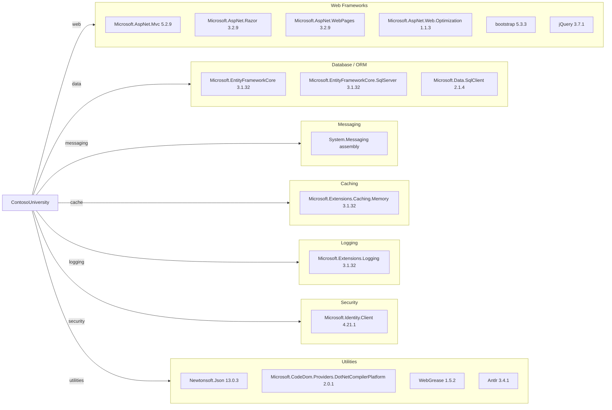

# Dependency Map

This document summarizes declared external dependencies for ContosoUniversity from `packages.config` and project references, grouped by functional category.

## Dependencies

### Dependency Summary

| Category | Count | Key Libraries | Notes |
|---|---:|---|---|
| Web Frameworks | 6 | Microsoft.AspNet.Mvc, Razor, WebPages, bootstrap | Legacy ASP.NET MVC 5 server-rendered stack |
| Database / ORM | 3 | EF Core, EF Core SqlServer, SqlClient | EF Core 3.1 on .NET Framework 4.8 |
| Messaging | 1 | System.Messaging | MSMQ dependency requires Windows messaging infrastructure |
| Caching | 1 | Microsoft.Extensions.Caching.Memory | In-memory cache primitives available |
| Logging | 1 | Microsoft.Extensions.Logging | Basic logging abstractions present |
| Security | 1 | Microsoft.Identity.Client | Identity client package present |
| Utilities | 4 | Newtonsoft.Json, CodeDom provider, WebGrease, Antlr | Supporting runtime and build-time libraries |

### Version & Compatibility Risks

The project targets .NET Framework 4.8 and depends on ASP.NET MVC 5 and EF Core 3.1, which increases migration effort for newer .NET target frameworks. `System.Messaging` is Windows-specific and is a common blocker for Linux/container modernization scenarios.

### Notable Observations

- `packages.config` package management is still used instead of modern `PackageReference`.
- Both legacy ASP.NET MVC packages and newer `Microsoft.Extensions.*` packages coexist in the same web application.
- Front-end libraries are tied to static package versions rather than modern build pipeline dependency management.
- Messaging integration uses MSMQ, indicating infrastructure coupling to Windows-hosted environments.

## Test Dependencies

| Framework | Version | Notes |
|---|---|---|
| None detected | N/A | No test-scoped packages found in `packages.config` |

Total test-scope dependencies: 0

No test dependencies were detected from declared package metadata in this project.
