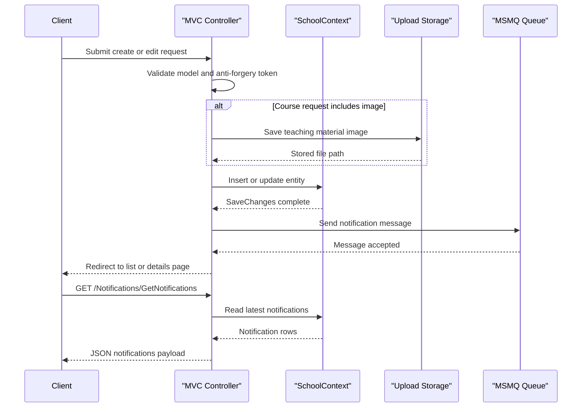

# API & Service Communication Contracts

ContosoUniversity exposes a server-rendered MVC surface with a small JSON notification endpoint set rather than a broad REST API. Communication is primarily synchronous request/response over HTTP, with asynchronous entity-change fan-out through MSMQ.

## Service Catalog

| Service | Port | Category | Purpose |
|---|---:|---|---|
| ContosoUniversity web application | 44300 (IIS Express profile) | API Layer / Business | Hosts MVC controllers, Razor views, EF Core data access, and notification operations |
| Local MSMQ private queue | N/A | Infrastructure | Receives asynchronous create/update/delete notification messages from the web application |
| SQL Server LocalDB | N/A | Infrastructure | Stores application data and notification records |

## API Endpoints Inventory

| Service | Method | Path | Request Type | Response Type |
|---|---|---|---|---|
| ContosoUniversity | GET | `/` and `/Home/Index` | none | Razor HTML view |
| ContosoUniversity | GET | `/Home/About` | none | Razor HTML view with `EnrollmentDateGroup` summaries |
| ContosoUniversity | GET | `/Home/Contact` | none | Razor HTML view |
| ContosoUniversity | GET | `/Students` | query params: `sortOrder`, `currentFilter`, `searchString`, `page` | Razor HTML view with paged `Student` list |
| ContosoUniversity | GET/POST | `/Students/Create`, `/Students/Edit/{id}` | bound `Student` model | Redirect to list or Razor HTML form with validation errors |
| ContosoUniversity | GET/POST | `/Students/Delete/{id}` | path id | Confirmation view or redirect |
| ContosoUniversity | GET | `/Courses` and `/Courses/Details/{id}` | optional path id | Razor HTML views over `Course` data |
| ContosoUniversity | GET/POST | `/Courses/Create`, `/Courses/Edit/{id}` | bound `Course` model plus multipart `HttpPostedFileBase` | Redirect or Razor HTML form with validation errors |
| ContosoUniversity | GET/POST | `/Courses/Delete/{id}` | path id | Confirmation view or redirect |
| ContosoUniversity | GET | `/Instructors` | optional `id`, `courseID` query/path values | Razor HTML view with `InstructorIndexData` |
| ContosoUniversity | GET/POST | `/Instructors/Create`, `/Instructors/Edit/{id}` | bound `Instructor` plus `selectedCourses[]` | Redirect or Razor HTML form with validation errors |
| ContosoUniversity | GET/POST | `/Instructors/Delete/{id}` | path id | Confirmation view or redirect |
| ContosoUniversity | GET | `/Departments`, `/Departments/Details/{id}` | optional path id | Razor HTML views over `Department` data |
| ContosoUniversity | GET/POST | `/Departments/Create`, `/Departments/Edit/{id}` | bound `Department` model | Redirect or Razor HTML form with validation or concurrency errors |
| ContosoUniversity | GET/POST | `/Departments/Delete/{id}` | path id | Confirmation view or redirect |
| ContosoUniversity | GET | `/Notifications/GetNotifications` | none | JSON payload `{ success, notifications, count }` |
| ContosoUniversity | POST | `/Notifications/MarkAsRead` | notification id | JSON payload `{ success }` |
| ContosoUniversity | GET | `/Notifications` | none | Razor HTML view for notifications |

## Management & Observability Endpoints

| Service | Endpoint | Custom Metrics (if any) |
|---|---|---|
| ContosoUniversity | None detected | No health check, Swagger, or custom metrics endpoints found |

## DTOs & Contracts

The application mostly binds MVC views directly to entity classes such as `Student`, `Course`, `Instructor`, and `Department`. Read-focused contract models are limited to `AssignedCourseData` (course checkbox state), `InstructorIndexData` (aggregated instructor/course/enrollment view model), and `EnrollmentDateGroup` (statistics response model for the About page). No OpenAPI document, protobuf schema, GraphQL schema, or immutable record-based contract types were found. Serialization for the JSON notification flow uses Newtonsoft.Json, and validation failures are surfaced through MVC `ModelState`, causing the server to redisplay the relevant view with errors rather than returning a formal problem-details contract.

## Communication Patterns

Synchronous communication is the dominant pattern: browser requests hit MVC controllers, controllers query or update EF Core, and Razor views or JSON responses are returned in the same request. Asynchronous behavior is limited to notification publication through MSMQ when controllers call `SendEntityNotification` after create, update, or delete operations; the browser later polls `NotificationsController` to retrieve notification state. No circuit breaker, retry library, service discovery mechanism, API gateway, or client-side load balancing is configured. The API security posture is partial: POST actions use anti-forgery validation and EF Core helps avoid SQL injection, but no active application authentication, authorization, or TLS-specific enforcement is implemented in code, so endpoint access is effectively public within the hosting environment.

## Service Technology Matrix

| Service | Web | Data Access | Discovery | Gateway | Actuator | Cache | Metrics |
|---|---|---|---|---|---|---|---|
| ContosoUniversity web application | ASP.NET MVC 5 | EF Core 3.1 with SQL Server | None | None | None | No significant runtime cache usage detected | None |
| Local MSMQ private queue | N/A | N/A | None | None | None | N/A | None |
| SQL Server LocalDB | N/A | N/A | None | None | None | N/A | None |

## Service Communication Sequence

