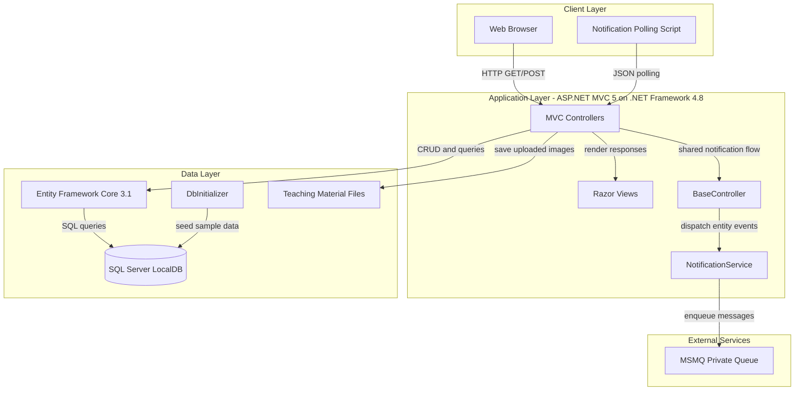
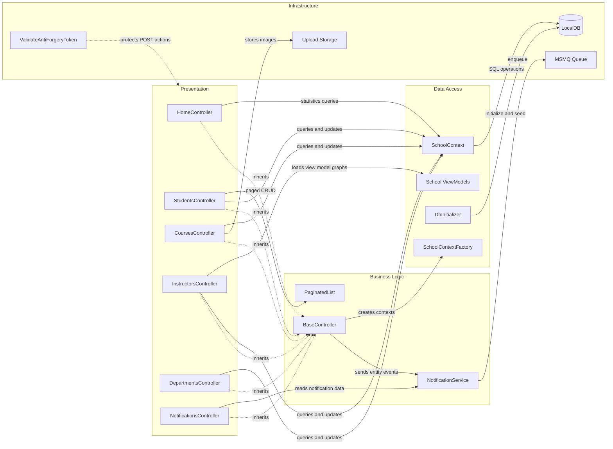

# Architecture Diagram

ContosoUniversity is a single ASP.NET MVC web application that combines presentation, business, and persistence concerns in one deployable unit. The codebase uses MVC controllers and Razor views over Entity Framework Core with SQL Server LocalDB, and publishes change notifications through MSMQ.

## Application Architecture

### Technology Stack Summary

| Layer | Technology | Version | Purpose |
|---|---|---:|---|
| Presentation | ASP.NET MVC | 5.2.9 | Server-side web framework and routing |
| Presentation | Razor | 3.2.9 | View templating |
| Presentation | jQuery + Bootstrap | 3.7.1 / 5.3.3 | Client-side behaviors and styling |
| Application | .NET Framework | 4.8 | Runtime for the web application |
| Application | Newtonsoft.Json | 13.0.3 | JSON serialization for notifications |
| Data | Entity Framework Core | 3.1.32 | ORM and LINQ-based persistence |
| Data | Microsoft.Data.SqlClient | 2.1.4 | SQL Server connectivity |
| Integration | MSMQ | OS feature | Asynchronous entity change notifications |
| Storage | SQL Server LocalDB | MSSQLLocalDB | Primary relational database |
| Storage | File system uploads | N/A | Teaching material image storage |

### Data Storage & External Services

The application stores operational data in a single SQL Server LocalDB database named `ContosoUniversityNoAuthEFCore`. Uploaded teaching material images are written to the local `Uploads/TeachingMaterials` directory, and entity create/update/delete events are emitted to a local MSMQ private queue for notification scenarios.

### Key Architectural Decisions

- Uses a monolithic MVC architecture where controllers directly coordinate EF Core queries and updates instead of going through a separate repository or application service layer.
- Centralizes notification dispatch in `BaseController`, allowing CRUD controllers to reuse the same MSMQ integration path for entity change events.
- Mixes traditional ASP.NET MVC 5 hosting with newer EF Core and Microsoft.Extensions libraries, which is functional but increases modernization and dependency-compatibility complexity.

## Component Relationships

### Component Inventory

| Component | Layer | Type | Responsibility |
|---|---|---|---|
| HomeController | Presentation | MVC Controller | Landing pages and enrollment statistics |
| StudentsController | Presentation | MVC Controller | Student search, paging, and CRUD |
| CoursesController | Presentation | MVC Controller | Course CRUD and teaching material uploads |
| InstructorsController | Presentation | MVC Controller | Instructor CRUD plus course assignment orchestration |
| DepartmentsController | Presentation | MVC Controller | Department CRUD with concurrency handling |
| NotificationsController | Presentation | MVC Controller | Notification polling and mark-as-read endpoints |
| BaseController | Business Logic | Base controller | Shared context creation and notification dispatch |
| NotificationService | Business Logic | Service | MSMQ message creation and queue operations |
| PaginatedList | Business Logic | Utility | Pagination helper for list screens |
| SchoolContext | Data Access | DbContext | Entity mapping and database interaction |
| SchoolContextFactory | Data Access | Factory | Creates configured DbContext instances |
| DbInitializer | Data Access | Initializer | Database bootstrap and seed data |
| AssignedCourseData / InstructorIndexData / EnrollmentDateGroup | Data Access | View models | Shapes data for complex UI views |
