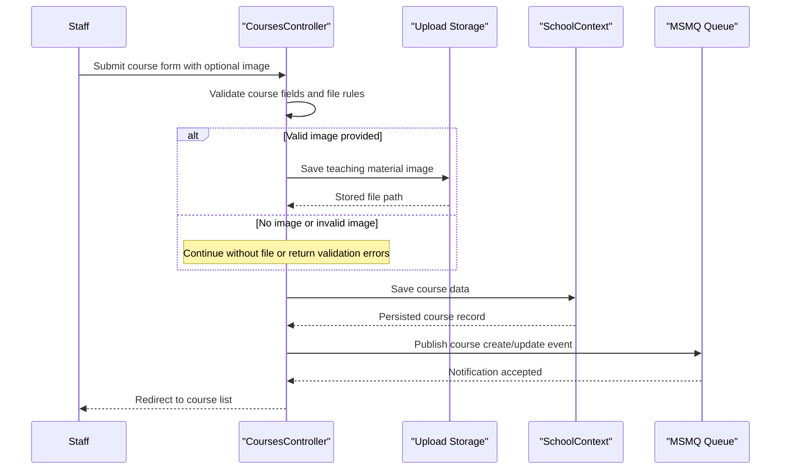

# Core Business Workflows

ContosoUniversity supports academic administration workflows for students, courses, instructors, departments, and operational notifications. The application focuses on staff-facing CRUD flows with a few richer processes such as instructor scheduling, course material uploads, and notification fan-out.

## Domain Entities

| Entity | Service / Bounded Context | Description | Key Relationships |
|---|---|---|---|
| Student | Academic Records | Learner profile used for enrollment tracking | Inherits from Person; links to many Enrollments |
| Instructor | Academic Staffing | Faculty member who can teach courses and administer departments | Inherits from Person; links to CourseAssignments, OfficeAssignment, Departments |
| Course | Curriculum Management | Catalog entry for a teachable course | Belongs to Department; links to Enrollments and CourseAssignments |
| Department | Organization Management | Academic department with budget and administrator | Owns many Courses; optionally references an Instructor administrator |
| Enrollment | Academic Records | Student participation and grade in a course | Connects Student and Course |
| CourseAssignment | Academic Staffing | Teaching assignment between instructor and course | Join entity between Instructor and Course |
| OfficeAssignment | Academic Staffing | Office location for an instructor | One-to-one with Instructor |
| Notification | Operations | Audit-style message for entity change events | Created from CRUD operations and surfaced to users |

## Service-to-Domain Mapping

| Service | Domain Context | Owned Entities | External Dependencies |
|---|---|---|---|
| ContosoUniversity web application | Academic administration | Student, Instructor, Course, Department, Enrollment, CourseAssignment, OfficeAssignment, Notification | SQL Server LocalDB, MSMQ, local file storage |

## Primary Workflows

### Workflow 1: Manage a student roster

Staff open the student index, optionally search or sort results, and page through the roster. Creating or editing a student validates required name and enrollment date values, persists the change through `SchoolContext`, and then emits a CREATE or UPDATE notification. Deleting a student removes the row and its related enrollments before sending a DELETE notification.

### Workflow 2: Create or update a course with teaching materials

Staff create or edit a course, select the owning department, and optionally upload a teaching material image. The workflow validates file extension and size, saves the file to `Uploads/TeachingMaterials`, stores the virtual path on the course record, and then commits the course update. A notification is published after persistence so the UI can later surface the change.

### Workflow 3: Maintain instructor assignments

Staff create or edit instructors, optionally assign office locations, and select one or more course assignments. The controller updates the instructor aggregate, synchronizes the many-to-many `CourseAssignment` set, and keeps office assignment data aligned with the instructor record. The saved result is followed by a notification describing the change.

### Workflow 4: Update a department with concurrency protection

Staff edit department metadata such as name, budget, start date, and administrator. The workflow checks model validity, attempts to save with the entity `RowVersion`, and handles optimistic concurrency exceptions by redisplaying current database values when a conflict is detected. Successful updates emit a notification; failed saves preserve the user workflow with conflict guidance.

## Cross-Service Data Flows

Although the repository is a monolith rather than a multi-service system, it still has a meaningful cross-boundary data flow between the MVC request pipeline, SQL persistence, MSMQ, and file storage. Academic CRUD flows source authoritative data from SQL Server LocalDB, while notification side effects are pushed asynchronously to MSMQ after the database write completes. Course image uploads add a second side channel by writing files to local storage and then storing the resulting file path in the relational model.

## Business Workflow Sequence

## Business Rules & Decision Logic

- Student enrollment dates and instructor hire dates must fall within the SQL Server-supported date range used by the application.
- Course titles require a minimum length, course credits must remain in the configured numeric range, and uploaded teaching material images must match the allowed extension whitelist and size threshold.
- Department edits use optimistic concurrency through `RowVersion`, so conflicting updates are detected and surfaced back to the user rather than silently overwritten.
- Instructor editing includes synchronization logic for course assignments and office assignment presence, ensuring related academic staffing data remains consistent.
- Every successful create, update, or delete action triggers a notification side effect, but notification failures are handled separately so that the primary business transaction can still complete.
