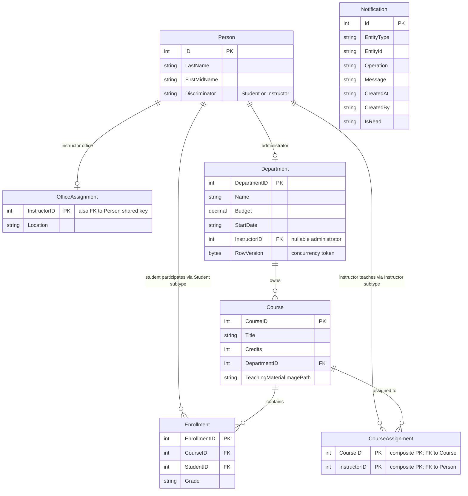

# Data Architecture & Persistence Layer

ContosoUniversity uses a single relational database accessed through Entity Framework Core 3.1 from an ASP.NET MVC application. The persistence model contains nine core entity sets, including a table-per-hierarchy `Person` model, academic domain entities, and a notification record store.

## Database Configuration

| Service/Module | DB Type | Profile | Driver | Connection | Migration Tool |
|---|---|---|---|---|---|
| ContosoUniversity | SQL Server LocalDB | Default | Microsoft.Data.SqlClient 2.1.4 | LocalDB connection to `ContosoUniversityNoAuthEFCore` with integrated security and MARS | No formal migration tool detected; startup initializer seeds database |

## Data Ownership per Service

| Service | Tables Owned | ORM Framework | Caching | Notes |
|---|---|---|---|---|
| ContosoUniversity | Person, Course, Enrollment, Department, OfficeAssignment, CourseAssignment, Notification | Entity Framework Core 3.1 | None detected in active code paths | Single shared database for all modules; notifications also mirrored to MSMQ |

## Entity Model

## Key Repository Methods

| Service | Repository | Notable Methods | Purpose |
|---|---|---|---|
| ContosoUniversity | `SchoolContext` via controllers | `Students.Include(...).OrderBy(...).Skip(...).Take(...)` | Paged student listing with search and sort |
| ContosoUniversity | `SchoolContext` via controllers | `Instructors.Include(...).ThenInclude(...)` | Builds instructor, course, and enrollment drill-down views |
| ContosoUniversity | `SchoolContext` via controllers | `Courses.Include(c => c.Department)` | Returns course lists with department lookups |
| ContosoUniversity | `SchoolContext` via controllers | `Departments.Include(d => d.Administrator)` | Returns department lists with administrator details |
| ContosoUniversity | `SchoolContext` via controllers | LINQ group-by projection into `EnrollmentDateGroup` | Produces enrollment statistics for the About page |
| ContosoUniversity | `SchoolContext` via controllers | `Entry(entity).CurrentValues.SetValues(...)` and concurrency handling | Applies edits while preserving optimistic concurrency for departments |

## Caching Strategy

No active application-level caching strategy was identified in runtime code paths. The project references `Microsoft.Extensions.Caching.Memory`, but controllers and services do not use cache-aside, read-through, or session caching APIs. Current persistence behavior is direct database access per request, with client-side polling used for notifications rather than cached notification state.

## Data Ownership Boundaries

All business data is stored in a single shared SQL Server LocalDB database owned by the monolithic ContosoUniversity application, so there is no database-per-service separation. Cross-module data access occurs through direct `DbContext` queries inside controllers, with eager loading (`Include` / `ThenInclude`) used to traverse academic relationships such as students to enrollments to courses and instructors to course assignments. Write paths are strongly consistent within a single request/transaction boundary because CRUD actions call `SaveChanges()` immediately; no CQRS split or asynchronous write model is present.

### Data Classification & Sensitivity

| Entity | Sensitive Fields | Classification (PII/PHI/PCI/None) | Controls in Place |
|---|---|---|---|
| Person / Student / Instructor | FirstMidName, LastName, ID | PII | Standard MVC model binding only; no masking or field-level access control detected |
| Student | EnrollmentDate, enrollments | PII | No encryption or masking detected |
| Enrollment | Grade, StudentID | PII | No encryption or masking detected |
| Department | Budget | None | Concurrency token present, but no special confidentiality controls detected |
| Notification | CreatedBy, entity identifiers, messages | PII | Stored in DB and MSMQ; no masking or encryption detected |
| Course, CourseAssignment, OfficeAssignment | Academic metadata, office location | None | No special controls detected |
