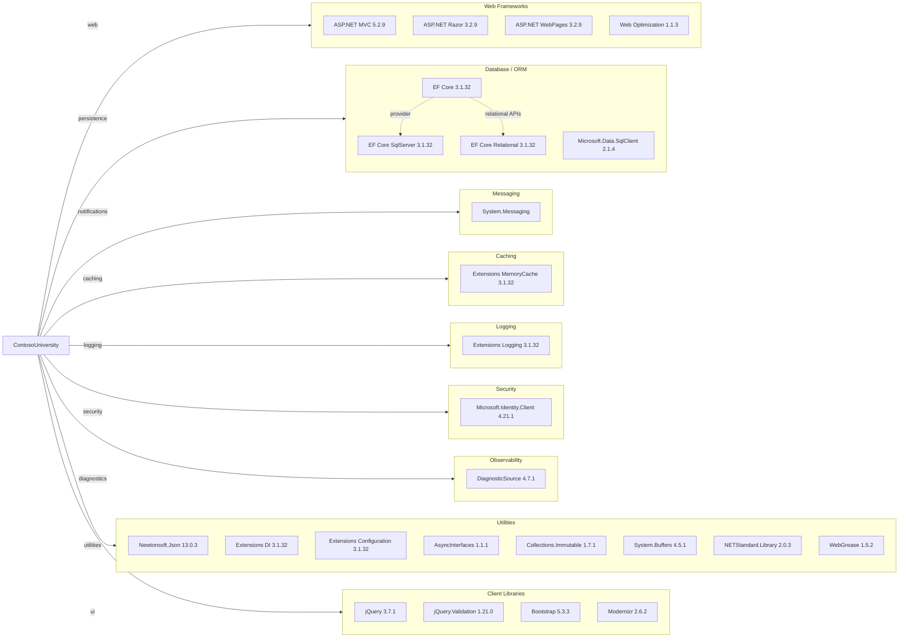

# Dependency Map

ContosoUniversity declares a moderate dependency set centered on ASP.NET MVC, Entity Framework Core, and SQL Server integration. The project has roughly 19 non-test external library groups and no declared automated test dependencies.

## Dependencies

### Dependency Summary

| Category | Count | Key Libraries | Notes |
|---|---:|---|---|
| Web Frameworks | 4 | ASP.NET MVC, Razor, WebPages, Web Optimization | Legacy MVC stack hosted on .NET Framework |
| Database / ORM | 4 | EF Core, EF Core SqlServer, SqlClient | Modern ORM layered onto classic MVC app |
| Messaging | 1 | System.Messaging | Relies on Windows MSMQ, which is not cross-platform |
| Caching | 1 | Microsoft.Extensions.Caching.Memory | Declared dependency; no significant cache usage found in code |
| Logging | 1 | Microsoft.Extensions.Logging | Package is present but app mainly uses Debug output |
| Security | 1 | Microsoft.Identity.Client | Present as dependency but not actively integrated into request pipeline |
| Observability | 1 | System.Diagnostics.DiagnosticSource | Diagnostic support through supporting libraries |
| Utilities | 8 | Newtonsoft.Json, DI, Configuration, WebGrease | Includes compatibility and infrastructure libraries |
| Client Libraries | 4 | jQuery, Validation, Bootstrap, Modernizr | Traditional browser-side MVC assets |

### Version & Compatibility Risks

The dependency set combines ASP.NET MVC 5 on .NET Framework 4.8 with EF Core 3.1.x, which is out of support and introduces modernization friction. MSMQ and System.Web-based packages are tightly coupled to Windows hosting, while the hybrid use of Microsoft.Extensions packages and legacy WebApplication targets creates upgrade and cross-platform build risks.

### Notable Observations

- No automated test framework packages are declared, so dependency changes cannot be validated through existing unit or integration tests.
- The repository includes a Bootstrap 5 package reference while the checked-in site assets still reflect a traditional MVC bundling model, indicating some client-library drift.
- `Microsoft.Identity.Client` is referenced even though authentication and authorization are not actively enforced in the controller pipeline.
- `NETStandard.Library` and multiple compatibility packages are needed to support EF Core and Extensions libraries on .NET Framework.

## Test Dependencies

| Framework | Version | Notes |
|---|---|---|
| None detected | N/A | No xUnit, NUnit, MSTest, or mocking/assertion packages declared |

Total test-scope dependencies: 0
No test dependencies detected. The repository does not contain a test project or test-scoped package declarations, so modernization work will rely on manual verification unless test infrastructure is introduced separately.
