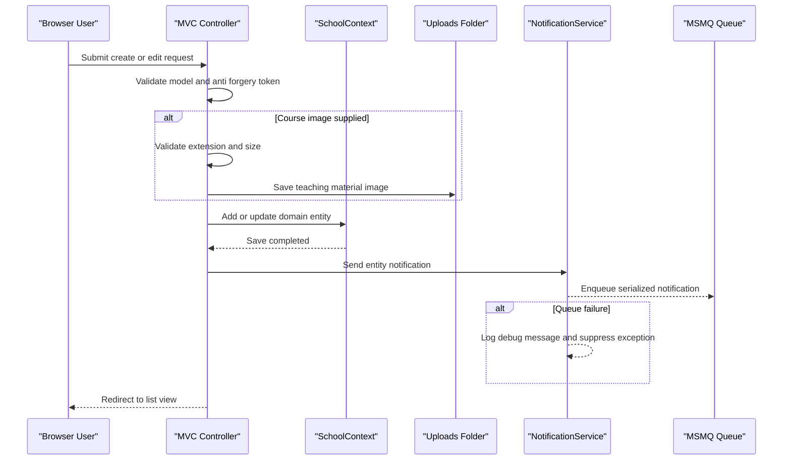

# API & Service Communication Contracts

The application exposes a server-rendered MVC surface with conventional routes and a small JSON notification API. Communication is primarily synchronous controller-to-database calls, with asynchronous notification delivery through MSMQ.

## Service Catalog

| Service | Port | Category | Purpose |
|---|---:|---|---|
| ContosoUniversity | 44300 for IIS Express, auto-assigned development port 58801 | API Layer / Business | Hosts MVC pages, JSON notification endpoints, EF Core data access, file uploads, and startup seeding |
| SQL Server LocalDB | Local process | Infrastructure | Stores school domain data for students, instructors, courses, departments, enrollments, and notifications |
| MSMQ private queue | Local queue path | Infrastructure | Queues serialized entity-change notifications |

## API Endpoints Inventory

| Service | Method | Path | Request Type | Response Type |
|---|---|---|---|---|
| ContosoUniversity | GET | `/` or `/Home/Index` | None | Razor view |
| ContosoUniversity | GET | `/Home/About` | None | Razor view with enrollment statistics |
| ContosoUniversity | GET | `/Home/Contact` | None | Razor view |
| ContosoUniversity | GET | `/Home/Error` | None | Razor error view |
| ContosoUniversity | GET | `/Home/Unauthorized` | None | Razor unauthorized view |
| ContosoUniversity | GET | `/Students` | Query: `sortOrder`, `currentFilter`, `searchString`, `page` | Razor view with paged `Student` list |
| ContosoUniversity | GET | `/Students/Details/{id}` | Path: nullable student id | Razor view with `Student` and enrollments |
| ContosoUniversity | GET | `/Students/Create` | None | Razor create form |
| ContosoUniversity | POST | `/Students/Create` | Form body bound to `Student` | Redirect on success or Razor form with validation errors |
| ContosoUniversity | GET | `/Students/Edit/{id}` | Path: nullable student id | Razor edit form |
| ContosoUniversity | POST | `/Students/Edit/{id}` | Form body bound to `Student` | Redirect on success or Razor form with validation errors |
| ContosoUniversity | GET | `/Students/Delete/{id}` | Path: nullable student id | Razor delete confirmation |
| ContosoUniversity | POST | `/Students/Delete/{id}` | Path/form id | Redirect with success or error message |
| ContosoUniversity | GET | `/Courses` | None | Razor view with courses and departments |
| ContosoUniversity | GET | `/Courses/Details/{id}` | Path: nullable course id | Razor view with `Course` |
| ContosoUniversity | GET | `/Courses/Create` | None | Razor create form |
| ContosoUniversity | POST | `/Courses/Create` | Form body bound to `Course`, uploaded image | Redirect on success or Razor form with upload validation errors |
| ContosoUniversity | GET | `/Courses/Edit/{id}` | Path: nullable course id | Razor edit form |
| ContosoUniversity | POST | `/Courses/Edit/{id}` | Form body bound to `Course`, optional uploaded image | Redirect on success or Razor form with validation errors |
| ContosoUniversity | GET | `/Courses/Delete/{id}` | Path: nullable course id | Razor delete confirmation |
| ContosoUniversity | POST | `/Courses/Delete/{id}` | Path/form id | Redirect after delete |
| ContosoUniversity | GET | `/Departments` | None | Razor view with departments and administrators |
| ContosoUniversity | GET | `/Departments/Details/{id}` | Path: nullable department id | Razor view with `Department` |
| ContosoUniversity | GET | `/Departments/Create` | None | Razor create form |
| ContosoUniversity | POST | `/Departments/Create` | Form body bound to `Department` | Redirect on success or Razor form with validation errors |
| ContosoUniversity | GET | `/Departments/Edit/{id}` | Path: nullable department id | Razor edit form |
| ContosoUniversity | POST | `/Departments/Edit/{id}` | Form body bound to `Department` with row version | Redirect or concurrency validation view |
| ContosoUniversity | GET | `/Departments/Delete/{id}` | Path: nullable department id | Razor delete confirmation |
| ContosoUniversity | POST | `/Departments/Delete/{id}` | Path/form id | Redirect after delete |
| ContosoUniversity | GET | `/Instructors` | Query: optional instructor id and course id | Razor view with instructor, course, and enrollment drill-down |
| ContosoUniversity | GET | `/Instructors/Details/{id}` | Path: nullable instructor id | Razor view with `Instructor` |
| ContosoUniversity | GET | `/Instructors/Create` | None | Razor create form with assigned-course selections |
| ContosoUniversity | POST | `/Instructors/Create` | Form body bound to `Instructor`, `selectedCourses` array | Redirect or Razor form with validation errors |
| ContosoUniversity | GET | `/Instructors/Edit/{id}` | Path: nullable instructor id | Razor edit form with assigned-course selections |
| ContosoUniversity | POST | `/Instructors/Edit/{id}` | Path id and `selectedCourses` array | Redirect or Razor form with validation errors |
| ContosoUniversity | GET | `/Instructors/Delete/{id}` | Path: nullable instructor id | Razor delete confirmation |
| ContosoUniversity | POST | `/Instructors/Delete/{id}` | Path/form id | Redirect after delete |
| ContosoUniversity | GET | `/Notifications/GetNotifications` | None | JSON object containing success flag, up to 10 `Notification` items, and count |
| ContosoUniversity | POST | `/Notifications/MarkAsRead` | Form/query id | JSON success flag |
| ContosoUniversity | GET | `/Notifications/Index` | None | Razor notification dashboard |

## Management & Observability Endpoints

| Service | Endpoint | Custom Metrics (if any) |
|---|---|---|
| ContosoUniversity | None detected | No health check, Swagger, metrics, or custom metric endpoint detected |

## DTOs & Contracts

MVC actions bind directly to service-level domain entities (`Student`, `Course`, `Department`, `Instructor`) and use view models (`InstructorIndexData`, `AssignedCourseData`, `EnrollmentDateGroup`) for UI composition. `Notification` acts as both a database entity and JSON message contract for queued notifications. No OpenAPI, Swagger, protobuf, GraphQL, immutable records, or gateway-level aggregation DTOs were detected; serialization for notification messages uses Newtonsoft.Json.

## Communication Patterns

Controllers make synchronous in-process calls to EF Core through `SchoolContext`, usually returning Razor views or redirects. Mutating workflows send asynchronous best-effort messages to MSMQ through `NotificationService`; notification failures are caught and logged to debug output so primary CRUD operations continue. No REST-to-REST service calls, gRPC, service discovery, API gateway, circuit breaker, retry policy, client-side load balancing, or explicit timeout policy was detected. Startup initializes routes, filters, bundles, then creates and seeds the database before the application is available. HTTPS is configured for IIS Express, but no global authentication or authorization enforcement is active; the global authorization filter is commented out and endpoints are effectively public at the MVC contract level.

## Service Technology Matrix

| Service | Web | Data Access | Discovery | Gateway | Actuator | Cache | Metrics |
|---|---|---|---|---|---|---|---|
| ContosoUniversity | ASP.NET MVC 5 | EF Core 3.1 with SQL Server | None | None | None | Packages referenced, no usage detected | None |
| SQL Server LocalDB | N/A | Relational database | N/A | N/A | N/A | N/A | N/A |
| MSMQ private queue | N/A | Queue storage | N/A | N/A | N/A | N/A | N/A |

## Service Communication Sequence

