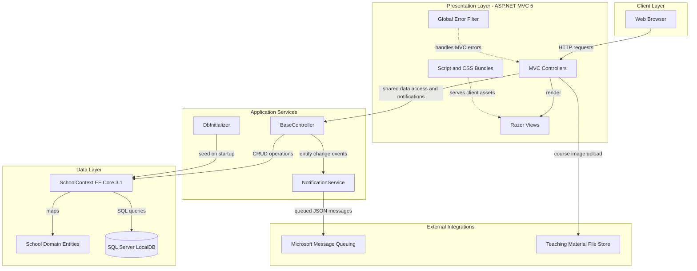
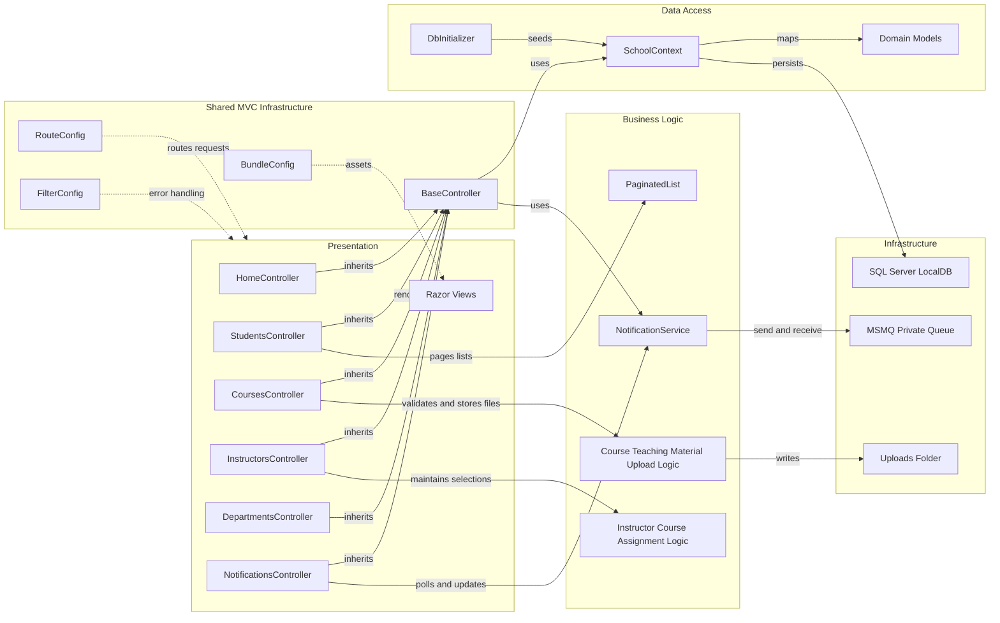

# Architecture Diagram

ContosoUniversity is a single ASP.NET MVC web application that serves Razor views for school administration workflows and uses Entity Framework Core for persistence. The application is organized around MVC controllers, EF Core domain models, and a queue-backed notification service.

## Application Architecture

### Technology Stack Summary

| Layer | Technology | Version | Purpose |
|---|---:|---:|---|
| Presentation | ASP.NET MVC | 5.2.9 | Server-rendered MVC controllers and Razor views |
| Runtime | .NET Framework | 4.8 | Legacy ASP.NET web application runtime |
| Data Access | Entity Framework Core | 3.1.32 | ORM for SQL Server persistence |
| Database | SQL Server LocalDB | MSSQLLocalDB | Local relational database configured by `DefaultConnection` |
| Messaging | System.Messaging / MSMQ | .NET Framework built-in | Queue notifications for entity create, update, and delete events |
| Serialization | Newtonsoft.Json | 13.0.3 | Serializes notification messages |
| Client Assets | Bootstrap, jQuery, MVC bundles | Bootstrap 5.3.3, jQuery 3.7.1 | UI styling, validation, and script bundling |

### Data Storage & External Services

The application stores school data in a SQL Server LocalDB database named `ContosoUniversityNoAuthEFCore`. It also writes uploaded course teaching material images to the web application's `Uploads/TeachingMaterials` directory and publishes entity-change notifications to a private MSMQ queue configured by `NotificationQueuePath`.

### Key Architectural Decisions

- Uses a classic ASP.NET MVC 5 monolith: controllers directly coordinate EF Core queries, view models, Razor views, and persistence.
- Centralizes context and notification access in `BaseController`, so CRUD controllers inherit the same `SchoolContext` and `NotificationService` lifecycle.
- Seeds demo data at application startup with `DbInitializer.Initialize`, using `Database.EnsureCreated` instead of versioned migrations.

## Component Relationships

### Component Inventory

| Component | Layer | Type | Responsibility |
|---|---|---|---|
| HomeController | Presentation | MVC Controller | Serves landing, about, contact, error, and unauthorized views |
| StudentsController | Presentation | MVC Controller | Manages student list, search, pagination, details, create, edit, and delete workflows |
| CoursesController | Presentation | MVC Controller | Manages courses, department selection, and teaching material image uploads |
| InstructorsController | Presentation | MVC Controller | Manages instructor profiles, office assignments, course assignments, and detail drill-downs |
| DepartmentsController | Presentation | MVC Controller | Manages departments, administrators, and optimistic concurrency handling |
| NotificationsController | Presentation | MVC Controller | Exposes JSON endpoints and dashboard for queued entity notifications |
| BaseController | Shared Infrastructure | MVC Base Class | Creates and disposes `SchoolContext` and `NotificationService`, and sends entity notifications |
| SchoolContext | Data Access | EF Core DbContext | Defines entity sets, table names, inheritance, relationships, and composite keys |
| DbInitializer | Data Access | Startup Seeder | Creates and seeds the database with sample university data |
| NotificationService | Business Logic | Service | Serializes notifications and exchanges messages with MSMQ |
| PaginatedList | Business Logic | Utility | Creates paged result sets for list screens |
| RouteConfig | Shared Infrastructure | MVC Configuration | Defines default MVC route `{controller}/{action}/{id}` |
| FilterConfig | Shared Infrastructure | MVC Configuration | Registers global MVC error handling |
| BundleConfig | Shared Infrastructure | Asset Configuration | Defines JavaScript and CSS bundles |
