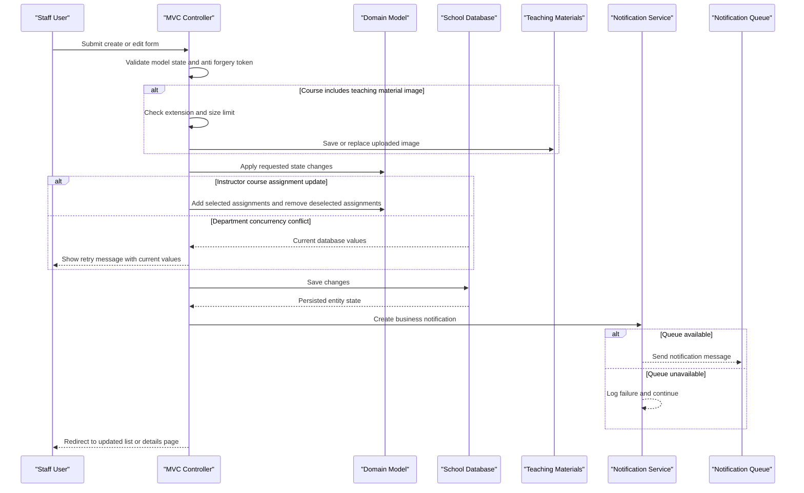

# Core Business Workflows

ContosoUniversity supports school administration workflows for managing students, instructors, courses, departments, enrollments, teaching materials, and operational notifications. The business processes are primarily staff-driven CRUD flows with validation, relationship maintenance, and notification side effects.

## Domain Entities

| Entity | Service / Bounded Context | Description | Key Relationships |
|---|---|---|---|
| Student | School Administration | A learner enrolled in the university | Enrolls in courses through enrollments |
| Instructor | School Administration | A teacher employed by the university | Teaches courses through course assignments, may have an office assignment, may administer departments |
| Course | Academic Catalog | A course offered by a department | Belongs to a department, has enrollments, may have teaching material image, has instructor assignments |
| Department | Academic Catalog | An organizational academic department | Offers courses and may have an instructor administrator |
| Enrollment | Academic Records | A student's registration and grade for a course | Joins a student and course |
| CourseAssignment | Teaching Assignment | Assignment of an instructor to teach a course | Joins instructor and course |
| OfficeAssignment | Faculty Administration | Office location for an instructor | One-to-one with instructor |
| Notification | Operations | Queued event describing create, update, and delete changes | References changed entity type and id |

## Service-to-Domain Mapping

| Service | Domain Context | Owned Entities | External Dependencies |
|---|---|---|---|
| ContosoUniversity | School Administration Monolith | Student, Instructor, Course, Department, Enrollment, CourseAssignment, OfficeAssignment, Notification | SQL Server LocalDB, local file system, MSMQ private queue |

## Primary Workflows

### Workflow 1: Manage Student Records

Staff list, search, sort, and page students, then create, edit, view, or delete individual student records. Create and edit validate required names and enrollment date range before saving. Successful mutations persist through EF Core and publish create, update, or delete notifications.

### Workflow 2: Manage Course Catalog and Teaching Materials

Staff create or edit courses, assign each course to a department, and optionally upload a teaching material image. The workflow validates MVC model state, accepts only image extensions, enforces a 5 MB upload limit, writes accepted files under `Uploads/TeachingMaterials`, persists the course, and emits a course notification. Course deletion also attempts to remove the associated uploaded file while allowing database deletion to continue if file cleanup fails.

### Workflow 3: Manage Instructors and Course Assignments

Staff create and edit instructors, including office assignment information and selected courses. The edit workflow loads current assignments, compares selected course IDs with existing assignments, adds missing join records, removes deselected assignments, saves all changes, and emits instructor notifications. When deleting an instructor, any department administrator reference to that instructor is cleared before removal.

### Workflow 4: Manage Departments with Concurrency Handling

Staff create, edit, view, and delete departments. The edit workflow uses a row version for optimistic concurrency and, on conflicting updates, shows current database values and prompts the user to retry with the latest row version.

### Workflow 5: Review Operational Notifications

Administrative users open the notification dashboard, which polls up to 10 queued notifications from MSMQ and returns JSON for display. Mark-as-read is exposed as a JSON operation, although the current implementation is a placeholder and does not persist read state changes.

## Cross-Service Data Flows

There are no independently deployed business services or gateway aggregation flows. Cross-component data flow is in-process: MVC controllers query EF Core entities and compose Razor view models. Entity mutations send a secondary asynchronous notification message through MSMQ; if notification delivery fails, the primary business operation still succeeds and the failure is only logged to debug output.

## Business Workflow Sequence

## Business Rules & Decision Logic

- MVC model validation enforces required names, string lengths, display formats, and anti-forgery checks on mutating form posts.
- Student create and edit explicitly reject missing, default, or SQL Server out-of-range enrollment dates.
- Course teaching material uploads are restricted to common image extensions and a maximum size of 5 MB.
- Instructor course selections are reconciled against current assignments so deselected courses are removed and newly selected courses are added.
- Department updates use optimistic concurrency; conflicts display current database values and require the user to retry.
- Entity create, update, and delete operations generate operational notifications; notification failures are non-blocking.
- Delete workflows perform related cleanup where needed, including course file deletion and clearing department administrator references before instructor deletion.
