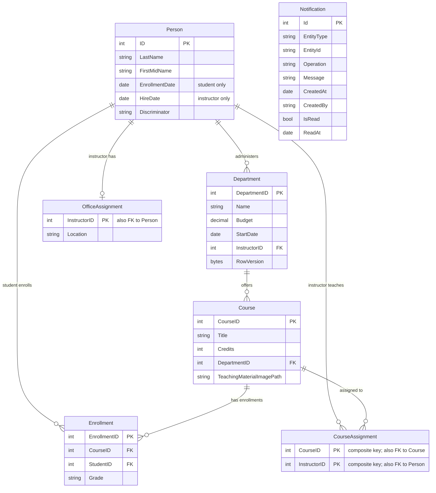

# Data Architecture & Persistence Layer

The data layer uses Entity Framework Core 3.1 over SQL Server LocalDB and models a school administration domain with nine DbSet-backed entities. Schema creation and seed data are performed during application startup rather than through versioned migrations.

## Database Configuration

| Service/Module | DB Type | Profile | Driver | Connection | Migration Tool |
|---|---|---|---|---|---|
| ContosoUniversity | SQL Server LocalDB | Default / development | Microsoft.Data.SqlClient through EF Core SqlServer | `DefaultConnection` points to `(LocalDb)\MSSQLLocalDB` and database `ContosoUniversityNoAuthEFCore` | None detected; startup calls `Database.EnsureCreated` and `DbInitializer.Initialize` |

## Data Ownership per Service

| Service | Tables Owned | ORM Framework | Caching | Notes |
|---|---|---|---|---|
| ContosoUniversity | Person, Course, Enrollment, Department, OfficeAssignment, CourseAssignment, Notification | Entity Framework Core 3.1 | No active cache usage detected | Single monolithic service owns all tables in a shared database schema |

## Entity Model

## Key Repository Methods

| Service | Repository | Notable Methods | Purpose |
|---|---|---|---|
| ContosoUniversity | `SchoolContext` DbSet properties | `Courses`, `Enrollments`, `Departments`, `OfficeAssignments`, `CourseAssignments`, `People`, `Students`, `Instructors`, `Notifications` | EF Core set access for all persistent entities |
| ContosoUniversity | Controller LINQ queries | `Include`, `ThenInclude`, `Where`, `Single`, `Find`, `OrderBy`, `Contains` | Implements read models for list, detail, and drill-down pages |
| ContosoUniversity | `DbInitializer` | `Database.EnsureCreated`, seed checks with `Students.Any`, duplicate enrollment check | Creates schema and seeds initial school data during application startup |
| ContosoUniversity | `InstructorsController` | `UpdateInstructorCourses` | Maintains many-to-many instructor-course assignments by adding and deleting join entities |

## Caching Strategy

No active application cache strategy was detected. `Microsoft.Extensions.Caching.*` packages are declared, but source code does not use `IMemoryCache`, distributed cache APIs, cache attributes, TTL settings, query-result caching, or second-level EF cache. The application relies on direct EF Core queries for each request.

## Data Ownership Boundaries

All domain entities are owned by the single ContosoUniversity web application and persisted in one SQL Server database. There is no database-per-service separation, no cross-service data access, and no CQRS split; controllers read and write the same EF Core model. Uploaded course images are stored outside the database in the web file system, while notification messages are also placed on MSMQ for asynchronous UI notification workflows.

### Data Classification & Sensitivity

| Entity | Sensitive Fields | Classification (PII/PHI/PCI/None) | Controls in Place |
|---|---|---|---|
| Person / Student / Instructor | First name, last name, enrollment date, hire date | PII | No encryption-at-rest, masking, or field-level access control detected in source or config |
| Department | Budget, administrator relationship | Internal business data | Optimistic concurrency through row version; no field-level access control detected |
| Enrollment | Student-course enrollment and grade | Education record / sensitive academic data | No encryption-at-rest, masking, or field-level access control detected |
| OfficeAssignment | Instructor office location | PII-adjacent location data | No encryption-at-rest, masking, or field-level access control detected |
| Notification | Entity type, entity id, message, creator | Operational metadata that may reference PII | Stored in database and queued as JSON; no message encryption detected |
| Course / CourseAssignment | Course title, credits, teaching material path, instructor assignment | Internal academic data | No special controls detected |
