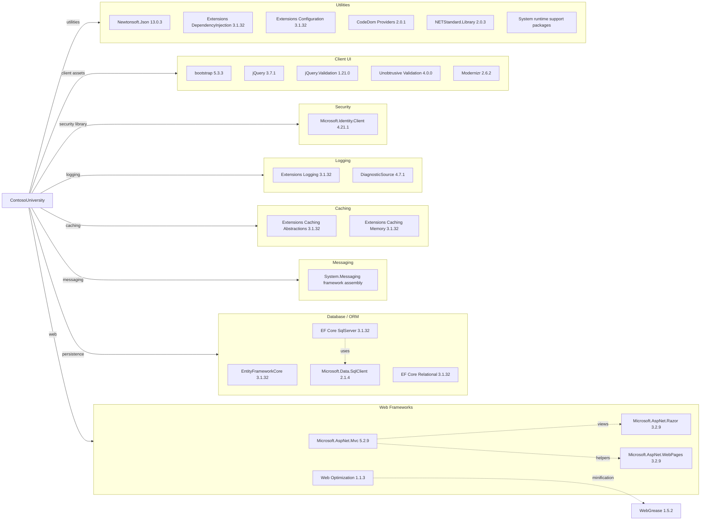

# Dependency Map

ContosoUniversity declares 45 NuGet package dependencies in `packages.config`, plus framework assembly references in the legacy project file. Runtime dependencies center on ASP.NET MVC, EF Core, SQL Server connectivity, client UI assets, and JSON serialization.

## Dependencies

### Dependency Summary

| Category | Count | Key Libraries | Notes |
|---|---:|---|---|
| Web Frameworks | 5 | ASP.NET MVC 5.2.9, Razor 3.2.9, WebPages 3.2.9 | Legacy ASP.NET MVC stack for .NET Framework |
| Database / ORM | 7 | EF Core 3.1.32, EF Core SqlServer 3.1.32, Microsoft.Data.SqlClient 2.1.4 | EF Core 3.1 is out of support and SQL Server-specific |
| Messaging | 1 | System.Messaging | Framework assembly for MSMQ private queues |
| Caching | 2 | Microsoft.Extensions.Caching.Abstractions, Memory | Referenced but no active cache usage detected in source |
| Logging | 2 | Microsoft.Extensions.Logging, DiagnosticSource | Framework logging packages referenced; source uses Trace and Debug directly |
| Security | 1 | Microsoft.Identity.Client 4.21.1 | Dependency is declared, but MVC authorization is disabled in global filters |
| Client UI | 5 | Bootstrap, jQuery, jQuery Validation, Unobtrusive Validation, Modernizr | Supports Razor form validation and UI styling |
| Utilities | 22 | Newtonsoft.Json, DI, Configuration, CodeDom, NETStandard, runtime support packages | Mostly compatibility and runtime support dependencies |

### Version & Compatibility Risks

The project targets .NET Framework 4.8 and uses ASP.NET MVC 5, both of which require a migration path to ASP.NET Core for modern .NET targets. EF Core 3.1 and several Microsoft.Extensions 3.1 packages are out of support, while `System.Messaging` depends on MSMQ and is not supported cross-platform in modern .NET.

### Notable Observations

- The project mixes legacy ASP.NET MVC 5 with EF Core 3.1 packages, creating migration concerns for both the web and data layers.
- `Microsoft.Identity.Client` is declared but no active authentication or authorization enforcement was detected in the MVC configuration.
- Client-side packages are restored through NuGet rather than npm, reflecting an older ASP.NET asset-management model.
- No test-scoped NuGet dependencies are declared.

## Test Dependencies

| Framework | Version | Notes |
|---|---:|---|
| None detected | N/A | No unit test, integration test, or mocking packages are declared in `packages.config`. |

Total test-scope dependencies: 0
No test dependencies detected. This limits automated validation for modernization changes.
